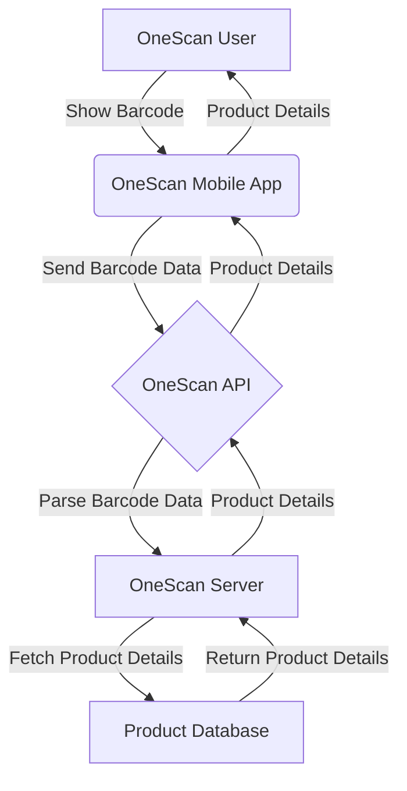

# VayCore/OneScan: The Future of Barcode Technology

## Architecture Flowchart

The VayCore/OneScan technology is an exciting new way to interact with barcode data. Instead of scanning a barcode with a traditional scanner, OneScan allows users to scan barcodes using their mobile device's camera and send the data through the OneScan API to a centralized server. The server then kicks off a series of requests to obtain information about the product associated with the barcode, returning that information back to the mobile app.

## How it Works

OneScan works by using a series of algorithms to read and parse the barcode data it receives. When a user scans a barcode with the OneScan mobile app, the app sends the data to the OneScan API. The API then passes that data onto the OneScan server, which is responsible for parsing the barcode data and returning information about the associated product to the mobile app.

One of the key advantages of OneScan is that it doesn't require any specialized hardware to use. Instead, the technology takes advantage of the powerful cameras that are built into all modern mobile devices. This means that the app can be used by anyone, anywhere, without any additional hardware.

## Why OneScan is so Exciting

There are many reasons why OneScan is such an exciting technology. For one thing, it greatly enhances the user experience of barcode scanning. With OneScan, users no longer have to struggle with bulky scanners or worry about positioning the scanner correctly. Instead, all they need to do is point their mobile device's camera at the barcode and let OneScan do the rest.

Another advantage of OneScan is that it is highly extensible. The technology is designed to integrate seamlessly with a wide variety of products and services, allowing businesses to easily incorporate it into their existing workflows. This means that OneScan has the potential to be used in a wide range of industries, from retail to healthcare to logistics.

## Conclusion

In conclusion, the VayCore/OneScan technology is an exciting new way to interact with barcode data. By leveraging the power of mobile devices, OneScan makes barcode scanning easier and more convenient than ever before. With its robust architecture and extensible design, OneScan is poised to revolutionize the way we think about barcode scanning, opening up new possibilities for businesses and consumers alike.