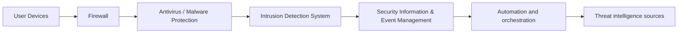

`**This article is part of a comprehensive automation program to automatically and programmatically post daily articles on development architecture, using OpenAI.**

# The $Digital Immune System: Protecting Your Digital World

In today's world, we rely on technology more than ever before. From emails to social media, documents to financial details, we store everything in our digital devices. But such ease and convenience comes with its own challenges. With cyber threats increasing day by day, keeping your digital environment safe and secure has become an absolute must. This is where the $Digital Immune System comes to play.

## What is the $Digital Immune System?

Just like our immune system protects our body from viruses and infections, the $Digital Immune System (DIS) is a set of technologies and processes that combine to protect your digital world. It encompasses everything from network security to antivirus protection, software updates to firewalls, and much more.

The DIS is designed to guard and monitor every aspect of your digital environment, from personal laptops to enterprise-level network infrastructures. It uses various techniques to detect and prevent any malicious activity, such as phishing scams, malware, ransomware, or hacking attempts.

The DIS works by regularly scanning all incoming and outgoing traffic and actively blocking any suspicious or malicious activity before it causes any harm. It can also detect and alert you in case of any violations or security breaches, enabling you to take immediate measures.

## The Architecture of the $Digital Immune System

To help you understand how the DIS works at a fundamental level, let's look at its architectural diagram. 

Simply put, the architecture consists of various layers of security controls that work together to protect your digital environment. The first is the device layer, where the user devices (laptops, smartphones, etc.) are connected through a Firewall, which acts as a shield against any unauthorized access attempts.

The next layer includes the Antivirus and Malware protection, serving as a barrier against any malicious software trying to infiltrate your devices. The Intrusion Detection System (IDS) complements it by analyzing the incoming and outgoing packets for any anomalous activity, triggering alerts if needed.

The Security Information and Event Management (SIEM) system then collects this information and provides a centralized view of potential security risks. The automation and orchestration layer automate the response to these risks, ensuring that even before the cybersecurity team intervenes, automated countermeasures are already in place.

Finally, the Threat Intelligence Sources layer provides regular updates on the latest threat trends and patterns, helping the DIS to evolve and adapt to new techniques and strategies.

## What can the $Digital Immune System do for you?

Having a robust DIS is essential to protecting your digital environment. It can help in several ways, including:

- Reducing the risk of cyberattacks and data breaches
- Enhancing the detection and response to any threat or breach attempts
- Providing a centralized platform for monitoring and management of your digital security landscape
- Regular updates and improvements to respond to changing cybersecurity trends and patterns

In conclusion, in this digital age, we must not overlook the importance of digital security. The DIS is a crucial tool in ensuring that our digital world stays safe and secure. By adopting a comprehensive and multi-layered approach, we can substantially reduce the risks of potential cyber threats and protect our digital assets.