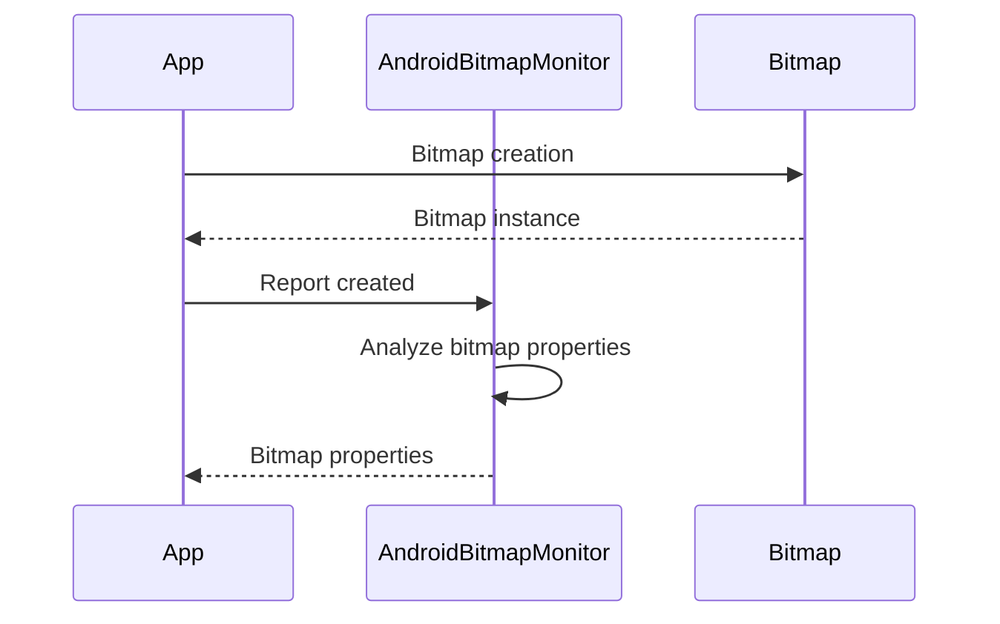

# Analyzing Android Bitmap Usage with AndroidBitmapMonitor

Are you tired of releasing apps that are slow or take up too much memory? One of the biggest culprits of these issues is improper handling of bitmaps. Fortunately, there is a tool that can help you analyze and optimize your use of bitmaps in Android apps: AndroidBitmapMonitor.

## Architecture

Here's a simplified flowchart of how AndroidBitmapMonitor works:



When your app creates a bitmap, AndroidBitmapMonitor receives a report of the bitmap creation. It then analyzes the properties of the bitmap, such as its dimensions and pixel format. The monitor can then report back to your app, helping you optimize your use of bitmaps.

## How to Use AndroidBitmapMonitor

Using AndroidBitmapMonitor is very simple. First, add the following dependencies in your project's `build.gradle` file:

```
dependencies {
    debugImplementation 'com.github.shixinzhang.AndroidBitmapMonitor:monitor:1.1.0'
    releaseImplementation 'com.github.shixinzhang.AndroidBitmapMonitor:noop:1.1.0'
}
```

Next, you need to initialize the monitor in your app's `Application` class:

```java
public class MyApplication extends Application {
    @Override
    public void onCreate() {
        super.onCreate();
        AndroidBitmapMonitor.initialize(this);
    }
}
```

Now, every time your app creates a bitmap, AndroidBitmapMonitor will receive a report of the creation.

To handle the reports, implement a `BitmapReportListener` in your code:

```java
AndroidBitmapMonitor.getInstance().addBitmapReportListener(new BitmapReportListener() {
    @Override
    public void onBitmapReport(BitmapReport report) {
        // Handle the report here
    }
});
```

You can then use the information in the report to optimize your app's bitmap usage.

## Conclusion

In conclusion, AndroidBitmapMonitor is an incredibly useful tool for optimizing your use of bitmaps in Android apps. By monitoring bitmap creation and analyzing their properties, this tool can help you reduce memory usage and improve app performance. So why not give it a try and see how it can benefit your app development process?