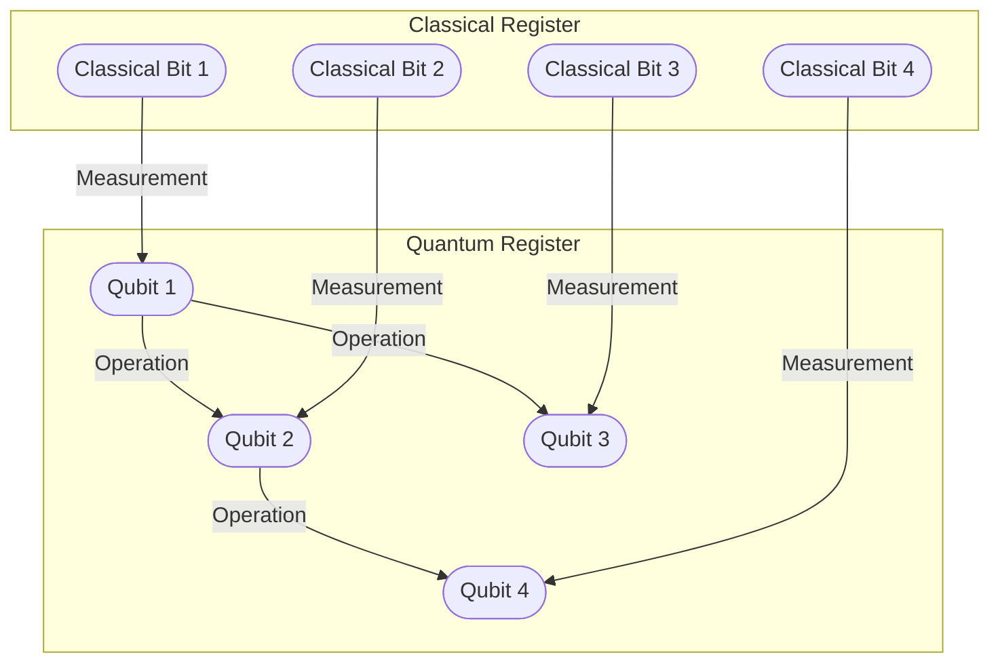

**`This article is part of a comprehensive automation program to automatically and programmatically post daily articles on development architecture, using OpenAI.`**

<article>

# Quantum Computing: The Future of Computing

The world of computing has always been focused on speed and efficiency. Quantum computing is the next level, beyond classical computing. It uses quantum bits or qubits instead of bits, making it much more powerful and faster.

## What is Quantum Computing?

Quantum computing is a type of computing that uses quantum mechanics principles, such as superposition and entanglement, to make calculations faster and more efficient than classical computing. Qubits, unlike bits, can exist in a superposition of states, allowing the computer to process multiple inputs at once.

In classical computing, data is stored in binary form, either 0 or 1. In quantum computing, qubits can exist as a 0 and 1 at the same time. This allows quantum computers to process and analyze large amounts of data simultaneously and solve complex problems that classical computers cannot.

## How is Quantum Computing Different?

Quantum computing is different from classical computing in many ways.

- Speed: Quantum computers can process multiple calculations simultaneously, increasing speed exponentially.
- Power: The ability to handle larger amounts of data with more complex algorithms, solving problems that classical computers cannot.
- Efficiency: Quantum computing requires far fewer resources to achieve the same results as classical computing.
- Security: Quantum computing can generate completely random numbers, useful in encryption.

## Applications of Quantum Computing

Quantum computing has a wide range of applications, many of which are still being researched and developed. Some of the potential applications include:

- Cryptography: Quantum computers can break many of today's encryption methods, but they can also create new unbreakable encryption algorithms.
- Machine Learning: Quantum computers can process data faster, allowing for better and more accurate machine learning models.
- Drug and Material Discovery: Quantum computing can calculate the precise molecular interactions that drive chemical reactions, opening up possibilities for faster drug discovery and material engineering.
- Financial Modeling: Quantum computers can handle complex financial models and simulations, allowing businesses to make better decisions.

## The Future of Quantum Computing

Quantum computing is still in the early stages of development, but it has the potential to be the future of computing. Many tech giants such as IBM, Google and Microsoft are investing heavily in quantum research and development.

The architecture of a quantum computer is complex and varies depending on the type of quantum technology used, such as superconducting, ion trapping or topological. However, a simple example of the high-level architecture using Mermaid can be seen below:

The future for quantum computing is still unknown, but it is clear that it could drastically improve many aspects of our lives. The possibilities are endless and will continue to grow as the technology evolves.

# Conclusion

Quantum computing is a promising and exciting field of computer science with many potential applications. It has the potential to revolutionize the way we process data and solve problems. As research continues, we could see quantum computers being used in fields such as finance, medicine, and cryptography. While still in its early stages, the future of quantum computing looks bright.

If you want to learn more about quantum computing, check out the [IBM Q Experience](https://www.ibm.com/quantum-computing/), which allows you to experiment with a real quantum computer through a web interface.

</article>
