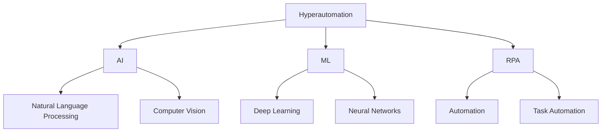
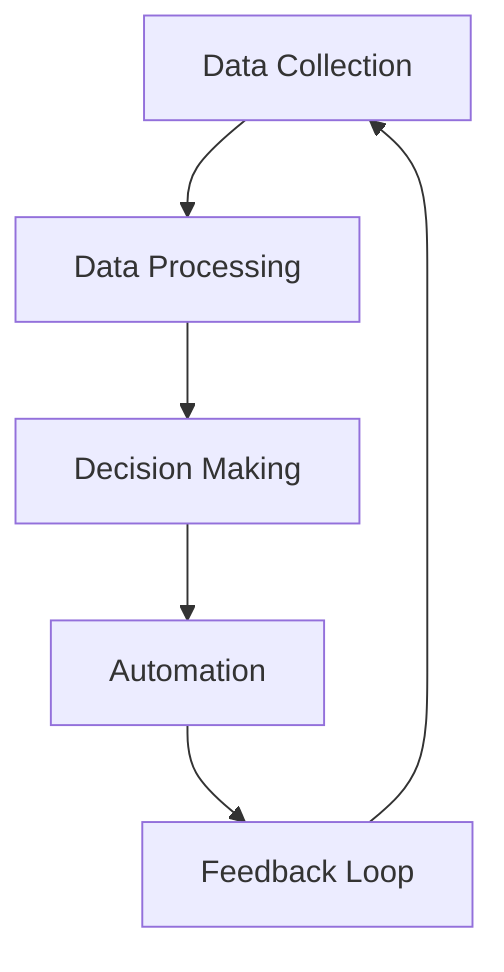

**`This article is part of a comprehensive automation program to automatically and programmatically post daily articles on development architecture, using OpenAI.`**

<article>

# Understanding Hyperautomation

The term "hyperautomation" has been gaining popularity in the world of enterprise technology. But what exactly does it mean? 

Hyperautomation is the combination of several technologies such as Artificial Intelligence (AI), Machine Learning (ML), Robotic Process Automation (RPA), and other automated processes. The goal of hyperautomation is to automate as many processes as possible to increase efficiency and productivity in a business. In other words, it’s automation to the extreme.

As seen in the diagram above, hyperautomation consists of three main components - AI, ML, and RPA.
  
### AI 
AI helps businesses automate tasks that require cognitive abilities. Natural Language Processing (NLP) is a branch of AI that enables computers to understand and interpret human language. Applications of NLP include chatbots, voice assistants, and sentiment analysis.

AI-powered Computer Vision involves advanced algorithms that enable machines to recognize, comprehend and respond to visual data. With AI, businesses can automate tasks such as object recognition, image and video analysis, and more.

### ML

ML is a subset of AI that allows machines to learn from data and improve their accuracy over time. Deep Learning is a type of ML that focuses on training neural networks with large amounts of data. ML can also be used in predictive modelling, anomaly detection, and other use cases.

### RPA

RPA is a software technology that automates rule-based, repetitive tasks. This can include tasks such as data entry, document processing, and more. With RPA, businesses can offload these tasks to bots, freeing up employees to focus on more complex tasks.
  
## Why is Hyperautomation important?
  
Hyperautomation is important because it allows organizations to automate more processes, with greater speed and accuracy than ever before. This can lead to significant cost savings, increased productivity, and better customer experiences. In today’s highly competitive business environment, organizations that can achieve these benefits will be the ones that succeed.

## How Does Hyperautomation Work?
  
Hyperautomation works by creating a digital twin of an organization's processes, both front-end and back-end. This twin can then be optimized and streamlined using AI and machine learning in order to make processes more efficient and effective.
Here’s an example: Let’s say you work at a bank and your job is to process loan applications. With hyperautomation, a digital twin of the loan application process would be created, including all the different steps, rules, and approvals required. AI and machine learning algorithms would then be used to optimize this process, making it faster and more accurate than a human could ever achieve.
  
To get a better idea of what hyperautomation looks like in action, let’s take a look at a simple diagram:

In this diagram, we can see the different stages of the hyperautomation process. First, data is collected (A) and then processed (B) using AI and machine learning algorithms. This data is then used to make decisions (C) about which processes should be automated (D). Finally, feedback is collected (E) to further optimize and improve the automation process.
  
  ## Conclusion

Hyperautomation is the future of work, as it allows organizations to automate more processes, faster and more accurately than ever before. With the power of AI and machine learning, businesses can achieve significant cost savings, increased productivity, and an improved customer experience. So, the next time you hear someone talking about hyperautomation, you’ll know exactly what they mean!

</article>
