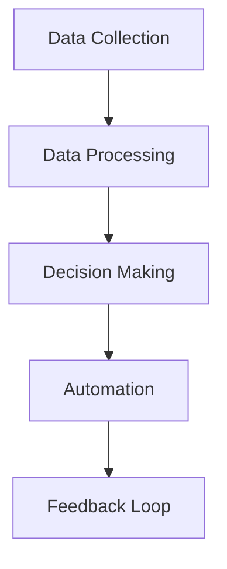

`**This article is part of a comprehensive automation program to automatically and programmatically post daily articles on development architecture, using OpenAI.**

<article>

# Hyperautomation: The Future of Work

Have you ever heard of the term hyperautomation? It’s a big buzzword in the tech industry right now, and for good reason. With the rise of automation and artificial intelligence, hyperautomation is a natural evolution of these technologies.

## What is Hyperautomation?

Hyperautomation is the combination of technologies like AI, machine learning, robotic process automation (RPA), and natural language processing (NLP) to automate and streamline as many business processes as possible. In other words, it’s automation to the extreme.

## How Does Hyperautomation Work?

Hyperautomation works by creating a digital twin of an organization's processes, both front-end and back-end. This twin can then be optimized and streamlined using AI and machine learning in order to make processes more efficient and effective.

Here’s an example: Let’s say you work at a bank and your job is to process loan applications. With hyperautomation, a digital twin of the loan application process would be created, including all the different steps, rules, and approvals required. AI and machine learning algorithms would then be used to optimize this process, making it faster and more accurate than a human could ever achieve.

## Why is Hyperautomation important?

Hyperautomation is important because it allows organizations to automate more processes, with greater speed and accuracy than ever before. This can lead to significant cost savings, increased productivity, and better customer experiences. In today’s highly competitive business environment, organizations that can achieve these benefits will be the ones that succeed.

## Hyperautomation in Action

To get a better idea of what hyperautomation looks like in action, let’s take a look at a simple diagram:

In this diagram, we can see the different stages of the hyperautomation process. First, data is collected (A) and then processed (B) using AI and machine learning algorithms. This data is then used to make decisions (C) about which processes should be automated (D). Finally, feedback is collected (E) to further optimize and improve the automation process.

## Conclusion

Hyperautomation is the future of work, as it allows organizations to automate more processes, faster and more accurately than ever before. With the power of AI and machine learning, businesses can achieve significant cost savings, increased productivity, and an improved customer experience. So, the next time you hear someone talking about hyperautomation, you’ll know exactly what they mean!

</article>