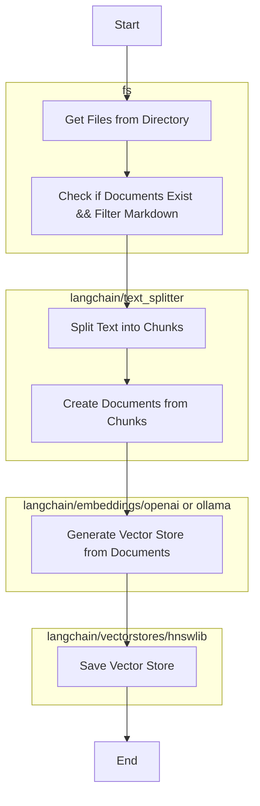
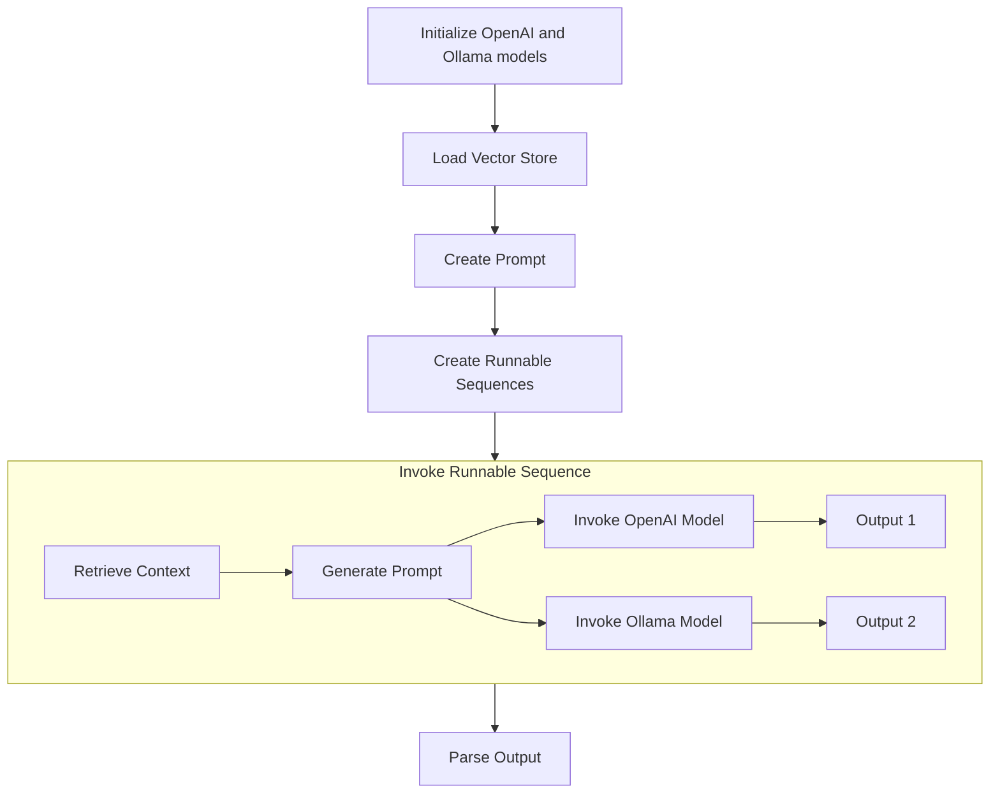

<article>


<div class="contenttable">
	
- [Introduction](#introduction)
- [Overview of Language Models](#overview-of-language-models)
	- [Definition and significance of language models in NLP](#definition-and-significance-of-language-models-in-nlp)
	- [Brief history and evolution of language models leading up to GPT-3](#brief-history-and-evolution-of-language-models-leading-up-to-gpt-3)
- [Introduction to LangchainJS and Ollama](#introduction-to-langchainjs-and-ollama)
	- [Detailed description of LangchainJS and its capabilities](#detailed-description-of-langchainjs-and-its-capabilities)
	- [Exploration of Ollama's framework and its role in local machine implementation.](#exploration-of-ollamas-framework-and-its-role-in-local-machine-implementation)
- [Setting Up the Environment](#setting-up-the-environment)
	- [Step-by-step guide to installing](#step-by-step-guide-to-installing)
		- [LangChainJS](#langchainjs)
		- [Ollama](#ollama)
	- [Best practices for setting up a conducive environment for training language models.](#best-practices-for-setting-up-a-conducive-environment-for-training-language-models)
- [Integrating HNSWLib for Efficient Vector Searching](#integrating-hnswlib-for-efficient-vector-searching)
	- [Explanation of HNSWLib and its importance in the context of language models](#explanation-of-hnswlib-and-its-importance-in-the-context-of-language-models)
	- [Guidance on incorporating HNSWLib into the training process for enhanced performance](#guidance-on-incorporating-hnswlib-into-the-training-process-for-enhanced-performance)
- [Creating a Training Dataset](#creating-a-training-dataset)
	- [Strategies for compiling a comprehensive and effective training dataset.](#strategies-for-compiling-a-comprehensive-and-effective-training-dataset)
	- [Techniques for preprocessing and structuring data for optimal training outcomes.](#techniques-for-preprocessing-and-structuring-data-for-optimal-training-outcomes)
- [The  process from training to querying](#the--process-from-training-to-querying)
	- [Training](#training)
		- [Diagram](#diagram)
	- [Querying](#querying)
		- [Diagram](#diagram)
- [Bringing the Model to Life](#bringing-the-model-to-life)
	- [Methods for testing and refining the trained model](#methods-for-testing-and-refining-the-trained-model)
	- [Tips for troubleshooting common issues during the training and implementation phases](#tips-for-troubleshooting-common-issues-during-the-training-and-implementation-phases)
- [Applications and Implications](#applications-and-implications)
	- [Discussion of potential applications of locally trained language models](#discussion-of-potential-applications-of-locally-trained-language-models)
	- [Reflection on the broader implications of accessible AI tools for developers and researchers](#reflection-on-the-broader-implications-of-accessible-ai-tools-for-developers-and-researchers)
- [Code](#code)
	- [Source](#source)
	- [Sample](#sample)
		- [train.js](#trainjs)
		- [query.js](#queryjs)
- [Conclusion](#conclusion)

</div>

In the ever-evolving realm of artificial intelligence, the ability to train and implement language models locally stands as a pivotal milestone. It symbolizes a shift towards greater accessibility, flexibility, and customization in the field of natural language processing (NLP). This article delves into the intricacies of harnessing open-source tools, specifically `LangchainJS` and `Ollama`,  and `HNSWLib` to train language models on a local machine—a feat that promises to democratize AI development.

## Introduction

The advent of language models like `OpenAI`'s `GPT-3` has revolutionized the way machines understand and generate human-like text. However, the real power of such models is unleashed when developers can train and tailor them according to their unique requirements. Enter `LangchainJS` and `Ollama`—two robust tools that facilitate this process on a local machine. `LangchainJS` serves as a comprehensive library for building AI applications with large language models, while `Ollama` offers a lightweight, extensible framework for running these models. Together, they form a formidable duo for any developer venturing into the realm of NLP. Also, `HNSWLib` is a library used for fast, memory-efficient vector searching, helpful in LLM contexts to store and quickly access related vectors to work on.

## Overview of Language Models

### Definition and significance of language models in NLP
Language models are a cornerstone of natural language processing (NLP), providing the foundation for machines to understand and generate human-like text. Their significance lies in their ability to grasp context, nuances, and subtleties of language, which is paramount for tasks like translation, summarization, and question-answering.

### Brief history and evolution of language models leading up to GPT-3
The journey of language models began with simple rule-based systems and gradually evolved through statistical models to the complex neural network-based models we see today. This evolution reached a pivotal moment with the introduction of `OpenAI`'s `GPT-3`, a state-of-the-art language model known for its deep understanding of language and its ability to generate coherent and contextually relevant text.

## Introduction to LangchainJS and Ollama

### Detailed description of LangchainJS and its capabilities
`LangchainJS` is an innovative JavaScript library designed to bridge the gap between large language models and application development. It provides a robust set of tools that enable developers to integrate sophisticated language models like `GPT-3` into their applications with ease. Its capabilities extend from simple text generation to complex tasks such as semantic search, text summarization, and even language translation, making it an indispensable tool in the arsenal of modern NLP developers.

### Exploration of Ollama's framework and its role in local machine implementation.
`Ollama` stands out as a lightweight and extensible framework specifically crafted for running language models on local machines. Its significance lies in its ability to provide a streamlined and efficient way to deploy and manage language models without the need for extensive infrastructure. With `Ollama`, developers can effortlessly bring the power of language models like `GPT-3` right to their desktops, enabling rapid prototyping, offline development, and personalized model training.

## Setting Up the Environment

### Step-by-step guide to installing

#### LangChainJS
The initial step towards training a local language model involves setting up a development environment capable of supporting the intricacies of NLP tasks. This begins with the installation of `LangchainJS`, which can be seamlessly integrated into your project via npm, the Node.js package manager. 

```sh
npm install langchain/embeddings/openai langchain/embeddings/ollama langchain/text_splitter hnswlib fs path
```

#### Ollama
Following this, `Ollama` is installed to facilitate the local deployment of language models. 
All usable **LangChain** LLM are available here: [LLMs](https://python.langchain.com/docs/integrations/llms/)
I'm using **Ollama**. Installation and **LangChain** usage are documented here: [LLM Ollama](https://python.langchain.com/docs/integrations/llms/ollama)

### Best practices for setting up a conducive environment for training language models.
Establishing a conducive environment for training language models is not just about installing the right software. It's about creating a workspace that fosters efficiency, accuracy, and innovation. This includes adhering to best practices such as version control with Git, setting up virtual environments to manage dependencies, and maintaining a structured project directory. Additionally, it's crucial to ensure that the hardware resources, such as CPU, GPU, and memory, are optimized to handle the computational demands of training language models.

## Integrating HNSWLib for Efficient Vector Searching

### Explanation of HNSWLib and its importance in the context of language models
`HNSWLib` is a cutting-edge library designed for efficient approximate nearest neighbor search in high dimensional spaces, which is crucial in the realm of language models. When a language model processes text, it converts it into high-dimensional vectors. These vectors encapsulate the semantic meaning of the text. `HNSWLib` shines by swiftly searching through these vectors to find the most relevant information, thereby enhancing the model's comprehension and response generation capabilities.

### Guidance on incorporating HNSWLib into the training process for enhanced performance
By integrating `HNSWLib`, developers ensure that their language models not only learn efficiently but also retrieve information with remarkable speed and accuracy during inference, significantly boosting performance.

## Creating a Training Dataset

### Strategies for compiling a comprehensive and effective training dataset.
Compiling a comprehensive and effective training dataset is paramount for the success of any language model. The key is diversity and relevance. Data should be collected from a variety of sources that align with the intended application of the model, ensuring a rich tapestry of language nuances, contexts, and styles. This can range from books and articles to transcripts and online forums, depending on the model's end goal.

### Techniques for preprocessing and structuring data for optimal training outcomes.
Once the data is collected, preprocessing and structuring become critical. Techniques like tokenization, stemming, and lemmatization help standardize the text, making it more digestible for the model. Noise reduction methods, such as removing special characters and correcting typos, further clean the dataset. Structuring the data in a consistent format, typically as JSON or CSV files, facilitates efficient training and can significantly impact the model's learning outcomes.

## The  process from training to querying

### Training
- The training process is a critical phase where the prepared dataset is fed into the model to develop its language understanding and generation capabilities. Using `LangchainJS`, developers can initiate the training by configuring the model parameters such as learning rate, batch size, and the number of epochs. `Ollama` plays a role here by providing the infrastructure to run the training locally.

- Once you have your training data, we can start the training process. The training process involves splitting the text into smaller chunks, creating a vector store using an embedding model, and then saving the trained model for future use.

Here's the step-by-step process:

1) **Split the text**: We first split the Markdown files into smaller chunks using a text splitter. In this case, we are using the RecursiveCharacterTextSplitter from LangchainJS. This will help us to better handle long texts and improve the performance of our model.

2) **Create documents**: After splitting the text, we create documents using the MarkdownTextSplitter. This will allow us to feed the training data into the vector store.

3) **Embedding model**: Next, we select an embedding model to generate vectors for each document. In this example, we are using OpenAI's embeddings from LangchainJS. You can also use other models like Ollama or Hugging Face Transformers.

4) **Vector store creation**: We then create a vector store using the HNSWLib library from LangchainJS. This vector store will be used to store and search for documents based on their embeddings.

5) **Saving the trained model**: Finally, we save the trained model using the save() function provided by the HNSWLib library. This allows us to use the trained model in future applications without needing to re-train it every time.
	
#### Diagram


	
Training a language model with **LangchainJS** is a straightforward process that involves splitting text into smaller *chunks*, creating *documents*, selecting an *embedding* model, and saving the *trained model*. With this approach, AI applications can understand and generate text based on their trained data.

### Querying
After the training completed we can query the `vector` database and use `LLM` to answer question.

Here's the step-by-step process:

1) **Initialize `OpenAI` and `Ollama` models** with specific parameters: the `OpenAI` model uses an API key and a temperature setting, while the `Ollama` model is initialized with a specific model name.

2) **Loading Vector Store**: use the HNSWLib library to load a vector store using the OpenAI embeddings. This will be used for context retrieval during the query process. This vector store is based on OpenAI embeddings and is used to retrieve relevant context for answering the question.

3) **Creating the Prompt**: use the PromptTemplate function to create  a prompt designed to answer the given question based on the loaded context from vector store. Something as `Answer the question based only on the following context: {context} \nQuestion: {question}`

4) **Creating and Invoke the Runnable Sequences**: sequences represent the steps that the AI models will follow to answer the question. They include retrieving the context, passing the question, generating the prompt, invoking the AI model, and parsing the output.

#### Diagram



Using different Large Language Models (LLMs) on the same dataset is an effective way to determine which model provides a more accurate or appropriate answer. This method can be used to benchmark and fine-tune settings for specific datasets, helping to optimize the
models' performance on similar tasks in the future.

## Bringing the Model to Life

### Methods for testing and refining the trained model
Once training is complete, it's essential to test and refine the model to ensure it meets the desired performance standards. This involves evaluating the model on a separate validation dataset and analyzing its ability to understand and generate text accurately. Techniques like cross-validation and confusion matrix analysis can provide insights into the model's strengths and weaknesses, guiding further refinements.

### Tips for troubleshooting common issues during the training and implementation phases
During the training and implementation phases, it's common to encounter issues such as overfitting, underfitting, or slow convergence. To address these, developers can adjust hyperparameters, augment the training data, or modify the model architecture. Implementing early stopping, regularization techniques, and learning rate schedules can also enhance the model's learning process. Monitoring tools like TensorBoard can aid in visualizing the training progress and pinpointing bottlenecks.

> [!NOTE] Note on performance
> Be aware that using LLM may consume significant resources. Therefore, choose the model and version based on your device's capabilities. Moreover, embedding can be computationally expensive due to the numerous parameters and calculations involved. *For small projects, I recommend using local embeddings from sources like **Ollama** or **HuggingFace***. However, if you have a massive amount of data, utilizing ***OpenAI** embeddings will be more efficient, faster, and won't strain your CPU/GPU*.

> [!NOTE] Note on effectiveness
> It took me some time to choose between chunking tools. There are various choices available in lanchain text splitter library, such as the simple *CharacterTextSplitter* or more complex and specific ones like the *MarkdownTextSplitter*. For a comprehensive list and explanation, check out this article: [Chunking Strategies](https://www.pinecone.io/learn/chunking-strategies/). However, *it's crucial to focus on embedding, as it significantly improves the quality of the ingested data by LLMs*. Currently, I mostly use **OpenAI** and **HuggingFace**
embeddings, but find **Ollama** a bit difficult to use.

> [!NOTE] Note2 on effectiveness
> [Chains](https://js.langchain.com/docs/modules/chains/document/)are a good way to improve the chunking, by summarizing, interpreting or classifying each document with a specific prompt before embedding it. This approach is particularly useful with heterogeneous dataset.

## Applications and Implications

### Discussion of potential applications of locally trained language models
The potential applications of locally trained language models are vast and varied. They range from enhancing customer service with chatbots that understand and respond to queries, to aiding in content creation by generating articles or scripts. In the educational sector, they can personalize learning by providing students with tailored feedback. In healthcare, they can interpret medical notes and assist in diagnosis. The decentralization aspect also allows for specialized training on niche datasets, leading to highly specialized models for unique industry needs.

### Reflection on the broader implications of accessible AI tools for developers and researchers
The broader implications of making AI tools like `LangchainJS` and `Ollama` accessible to developers and researchers are profound. It democratizes AI, enabling a wider community to innovate and experiment. This accessibility can accelerate the pace of AI advancements, leading to more diverse and creative applications. It also encourages ethical AI evelopment, as a broader base of developers can contribute to shaping the principles and practices guiding AI's evolution.

## Code

### Source
Available on github on : 

### Sample
Quick exemple using an express base to train and query

#### train.js
```js
const { OpenAIEmbeddings } = require("langchain/embeddings/openai");
const { OllamaEmbeddings } = require("langchain/embeddings/ollama");
const { HuggingFaceTransformersEmbeddings } = require("langchain/embeddings/hf_transformers");
const {
  MarkdownTextSplitter
} = require("langchain/text_splitter");
const { HNSWLib } = require("langchain/vectorstores/hnswlib");
const fs = require("fs");
const path = require("path");

async function getFiles(dir) {
  const dirents = await fs.promises.readdir(dir, { withFileTypes: true });

  const files = await Promise.all(dirents.map(async (dirent) => {
    const res = path.resolve(dir, dirent.name);

    return dirent.isDirectory() ? getFiles(res) : res;
  }));

  return Array.prototype.concat(...files);
}

async function getMarkdownFiles(directoryPath) {
  const files = await getFiles(directoryPath);

  return files.filter(file => {
    return (path.extname(file) === '.md'
      && !file.includes(".trash")
      && !file.includes("/assets"));
  });
}

async function getDocumentsFromFiles(mdFiles) {
  const documents = [];
  for (const file of mdFiles) {
    if (file && file.includes(".md")) {
      const trainingText = await fs.promises.readFile(file, "utf-8");
      if (trainingText) {
        documents.push(trainingText);
      }
    }
  }

  return documents;
}

async function createVectorStores(docs) {
  let vectorStoreOpenAI, vectorStoreOllama, vectorStoreHuggingface;

  vectorStoreOpenAI = await HNSWLib.fromDocuments(
    docs,
    new OpenAIEmbeddings({ openAIApiKey: process.env.OPENAI_API_KEY }),
  );
  vectorStoreOllama = await HNSWLib.fromDocuments(
    docs,
    new OllamaEmbeddings(),
  );
  vectorStoreHuggingface = await HNSWLib.fromDocuments(
    docs,
    new HuggingFaceTransformersEmbeddings(),
  );

  return { vectorStoreOpenAI, vectorStoreOllama, vectorStoreHuggingface };
}

async function trainBot(req, res) {
  console.log("Training ...");
  try {
    const directoryPath = "training-data";
    const mdFiles = await getMarkdownFiles(directoryPath);
    const documents = await getDocumentsFromFiles(mdFiles);

    if (documents.length === 0) {
      throw new Error("No documents to process");
    }

    const mdSplitter = new MarkdownTextSplitter({
      chunkSize: 1000,
    });

    const docs = await mdSplitter.createDocuments(documents);
    const { vectorStoreOpenAI, vectorStoreOllama, vectorStoreHuggingface } = await createVectorStores(docs);

    vectorStoreOpenAI.save("hnswlib_openai");
    vectorStoreOllama.save("hnswlib_ollama");
    vectorStoreHuggingface.save("hnswlib_huggingface");

    console.log("success");
    return res.status(200).json({
      message: vectorStoreOpenAI,
    });
  } catch (error) {
    console.error(error);
    res.status(500).json({ error: "Internal Server Error" });
  }
}

module.exports = trainBot;
```

#### query.js
```js
const { OpenAI } = require("langchain/llms/openai");
const { Ollama } = require("langchain/llms/ollama");
const { OpenAIEmbeddings } = require("langchain/embeddings/openai");
const { HNSWLib } = require("langchain/vectorstores/hnswlib");
const { PromptTemplate } = require("langchain/prompts");
const { StringOutputParser } = require("langchain/schema/output_parser");
const {
  RunnableSequence,
  RunnablePassthrough,
} = require("langchain/schema/runnable");

const modelOpenapi = new OpenAI({
  openAIApiKey: process.env.OPENAI_API_KEY,
  temperature: 0.9,
});

const modelOllama = new Ollama({ model: "mistral-openorca" });

async function getAnswer(req, res) {
  const { question } = req.body;
  try {
    const vectorStoreOpenAI = await HNSWLib.load(
      "hnswlib_openai",
      new OpenAIEmbeddings({ openAIApiKey: process.env.OPENAI_API_KEY }),
    );

    const prompt =
      PromptTemplate.fromTemplate(`Answer the question based only on the following context:
{context}

Question: {question}`);

    const serializeDocs = (docs) =>
      docs.map((doc) => doc.pageContent).join("\n");

    const chainOpenai = RunnableSequence.from([
      {
        context: vectorStoreOpenAI.asRetriever().pipe(serializeDocs),
        question: new RunnablePassthrough(),
      },
      prompt,
      modelOpenapi,
      new StringOutputParser(),
    ]);

    const chainOllamaWithOpenaiEmbedding = RunnableSequence.from([
      {
        context: vectorStoreOpenAI.asRetriever().pipe(serializeDocs),
        question: new RunnablePassthrough(),
      },
      prompt,
      modelOllama,
      new StringOutputParser(),
    ]);

    const resultOpenai = await chainOpenai.invoke(
      question
    );
    const resultOllamaWithOpenaiEmbedding = await chainOllamaWithOpenaiEmbedding.invoke(
      question
    );

    return res.status(200).json({
      answer_openai: resultOpenai,
      answer_ollama_with_openaiembedding: resultOllamaWithOpenaiEmbedding,
    });
  } catch (error) {
    console.log(error);
    return res.status(200).send({
      message: "Something went wrong",
      error,
    });
  }
}

module.exports = getAnswer;

```

## Conclusion

In conclusion, the process of training a language model using **LangchainJS** on a local machine is a testament to the flexibility and power of modern AI tools. By leveraging open-source libraries such as **LangchainJS** and frameworks like **Ollama**, along with the efficient vector searching capabilities of **HNSWLib**, developers can create and train robust language models tailored to their specific needs.

Throughout this guide, we've navigated the intricacies of setting up the necessary environment, creating a training dataset, and integrating various components to bring our language model to life. The provided code snippets serve as a practical reference, **illustrating how these tools can be combined to build a functioning language model capable of understanding and generating natural language**.

As AI continues to evolve, the accessibility of these technologies opens up a world of possibilities for developers, researchers, and businesses alike. Whether you're looking to enhance your application with natural language processing capabilities or explore the frontiers of AI research, the tools and techniques discussed in this article provide a solid foundation to embark on that journey.

By demystifying the process of training a language model on a local machine, we hope to **empower more individuals to innovate and contribute to the ever-growing landscape of AI**. The future is ripe with potential, and with the knowledge and resources at our disposal, there's no limit to what we can achieve.
