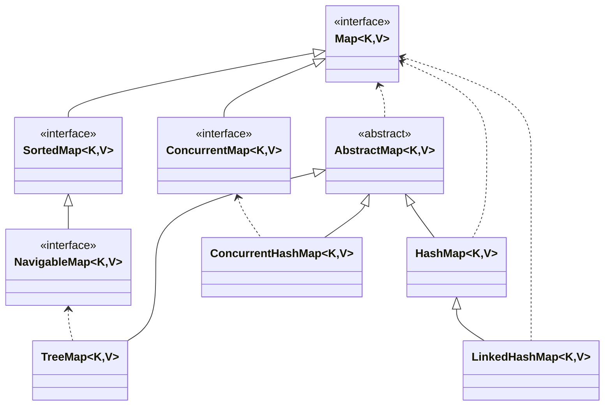

<article>

- [Overview](#overview)
  - [Why and when to use Maps?](#why-and-when-to-use-maps)
  - [Characteristics of a Map Interface](#characteristics-of-a-map-interface)
    - [Methods in Map Interface](#methods-in-map-interface)
- [Differences](#differences)
  - [HashMap](#hashmap)
  - [LinkedHashMap](#linkedhashmap)
  - [TreeMap](#treemap)
  - [ConcurrentHashMap](#concurrenthashmap)

## Overview

### Why and when to use Maps?

Maps are perfect to use for `key-value association mapping` such as `dictionaries`. The maps are used to perform lookups by keys or when someone wants to retrieve and update elements by keys.

### Characteristics of a Map Interface

1. A Map can contain `no duplicate keys` and `each key can map to at most one value`. Some implementations allow null key and null values like the HashMap and LinkedHashMap, but some do not like the TreeMap.
2. The order of a map depends on the specific implementations. For example, `TreeMap, LinkedHashMap and ConcurrentHashMap have predictable orders`, while `HashMap does not`.
3. There are `two interfaces` for implementing Map in java. They are **Map**, **SortedMap** and **ConcurrentMap**, and `three classes`: **HashMap**, **TreeMap**, **LinkedHashMap** and **ConcurrentHashMap**.

#### Methods in Map Interface

| Method | Action Performed  |
| --- | --- |
| **clear**() | This method is used to clear and remove all of the elements or mappings from a specified Map collection. |
| **containsKey**(Object) | This method is used to check whether a particular key is being mapped into the Map or not. It takes the key element as a parameter and returns True if that element is mapped in the map. |
| **containsValue**(Object) | This method is used to check whether a particular value is being mapped by a single or more than one key in the Map. It takes the value as a parameter and returns True if that value is mapped by any of the key in the map. |
| **entrySet**() | This method is used to create a set out of the same elements contained in the map. It basically returns a set view of the map or we can create a new set and store the map elements into them. |
| **equals**(Object) | This method is used to check for equality between two maps. It verifies whether the elements of one map passed as a parameter is equal to the elements of this map or not. |
| **get**(Object) | This method is used to retrieve or fetch the value mapped by a particular key mentioned in the parameter. It returns NULL when the map contains no such mapping for the key. |
| **hashCode**() | This method is used to generate a hashCode for the given map containing keys and values. |
| **isEmpty**() | This method is used to check if a map is having any entry for key and value pairs. If no mapping exists, then this returns true. |
| **keySet**() | This method is used to return a Set view of the keys contained in this map. The set is backed by the map, so changes to the map are reflected in the set, and vice-versa. |
| **put**(Object, Object) | This method is used to associate the specified value with the specified key in this map. |
| **putAll**(Map) | This method is used to copy all of the mappings from the specified map to this map. |
| **remove**(Object)  | This method is used to remove the mapping for a key from this map if it is present in the map. |
| **size**() | This method is used to return the number of key/value pairs available in the map. |
| **values**() | This method is used to create a collection out of the values of the map. It basically returns a Collection view of the values in the HashMap. |
| **getOrDefault**(Object key, V defaultValue) | Returns the value to which the specified key is mapped, or defaultValue if this map contains no mapping for the key. |
| **merge**(K key, V value, BiFunction<? super V,? super V,? extends V> remappingFunction) | If the specified key is not already associated with a value or is associated with null, associates it with the given non-null value. |
| **putIfAbsent**(K key, V value) | If the specified key is not already associated with a value (or is mapped to null) associates it with the given value and returns null, else returns the curassociaterent value. |

## Differences

`Map` is the interface type of map, while `HashMap`, `LinkedHashMap`, `TreeMap` and `ConcurrentHashMap` are the implementation type of map.
This means that the compiler will treat map object as being one of type Map, even though at runtime, it may point to any subtype of it.

### HashMap

HashMap is a part of Java's collection since Java 1.2. It provides the basic implementation of the Map interface of Java. It stores the data in (Key, Value) pairs. To access a value one must know its key. This class uses a technique called `Hashing`. Hashing is a technique of converting a large String to a small String that represents the same String. A shorter value helps in `indexing and faster searches`. HashMap provided the advantage of `quick insertion, search, and deletion`.

### LinkedHashMap

LinkedHashMap is just like HashMap with an additional feature of `maintaining an order of elements inserted into it`.

### TreeMap

The map is sorted according to the used constructor, whether `sorted according to the natural ordering of its keys`, or whether `sorted by a Comparator provided at map creation time`. This proves to be an efficient way of sorting and storing the key-value pairs. The storing order maintained by the treemap must be consistent with equals just like any other sorted map, irrespective of the explicit comparators.

### ConcurrentHashMap

The ConcurrentHashMap class is similar to HashMap, except that it's `thread-safe` and `synchronized` (HashMap can be thread-safe with external synchronization as Collections.synchornizedMap) and `allows modification while iteration` (regular HashMap throw a ConcurrentModificationException when another thread try to add/modify object content).
Generaly speaking, it's `perform better and is more scalable in a thread application context` and specific usage as when a number of reader threads outnumber the number of writer threads (cache scenario, ...)

---

références externes:

- [geeksforgeeks](https://www.geeksforgeeks.org/map-interface-java-examples/)

</article>
