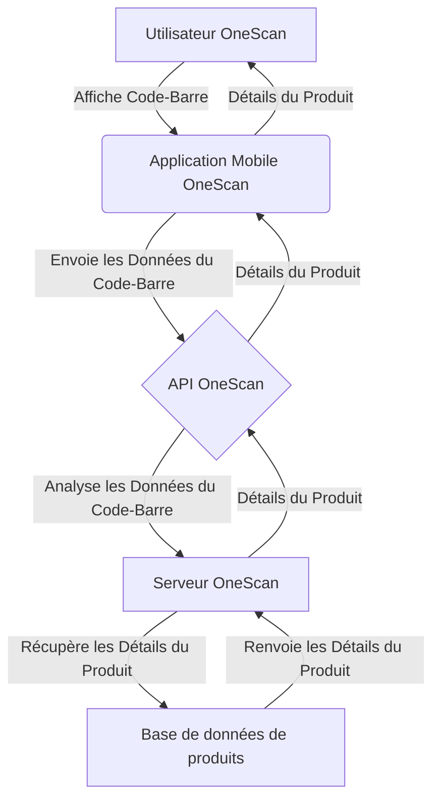

# VayCore/OneScan : l'avenir de la technologie des codes-barres

## Diagramme de flux d'architecture

La technologie VayCore/OneScan est une nouvelle façon passionnante d'interagir avec les données des codes-barres. Au lieu de scanner un code-barres avec un scanner traditionnel, OneScan permet aux utilisateurs de scanner des codes-barres en utilisant l'appareil photo de leur appareil mobile et d'envoyer les données via l'API OneScan à un serveur centralisé. Le serveur lance ensuite une série de demandes pour obtenir des informations sur le produit associé au code-barres, renvoyant ces informations à l'application mobile.

## Comment ça fonctionne

OneScan fonctionne en utilisant une série d'algorithmes pour lire et analyser les données des codes-barres qu'il reçoit. Lorsqu'un utilisateur scanne un code-barres avec l'application mobile OneScan, l'application envoie les données à l'API OneScan. L'API transmet ensuite ces données au serveur OneScan, qui est chargé d'analyser les données des codes-barres et de renvoyer des informations sur le produit associé à l'application mobile.

L'un des principaux avantages de OneScan est qu'il ne nécessite aucun matériel spécialisé pour être utilisé. Au lieu de cela, la technologie tire parti des puissants appareils photo intégrés à tous les appareils mobiles modernes. Cela signifie que l'application peut être utilisée par n'importe qui, n'importe où, sans aucun matériel supplémentaire.

## Pourquoi OneScan est si passionnant

Il y a de nombreuses raisons pour lesquelles OneScan est une technologie si passionnante. Tout d'abord, il améliore grandement l'expérience utilisateur de la lecture de codes-barres. Avec OneScan, les utilisateurs n'ont plus à lutter avec des scanners encombrants ou à se préoccuper de positionner correctement le scanner. Tout ce qu'ils ont à faire est de pointer l'appareil photo de leur appareil mobile sur le code-barres et de laisser OneScan faire le reste.

Un autre avantage de OneScan est qu'il est hautement extensible. La technologie est conçue pour s'intégrer parfaitement à une grande variété de produits et services, permettant aux entreprises de l'incorporer facilement à leurs flux de travail existants. Cela signifie que OneScan a le potentiel d'être utilisé dans un large éventail d'industries, du commerce de détail à la santé en passant par la logistique.

## Conclusion

En conclusion, la technologie VayCore/OneScan est une nouvelle façon passionnante d'interagir avec les données des codes-barres. En exploitant la puissance des appareils mobiles, OneScan rend la lecture de codes-barres plus facile et plus pratique que jamais. Avec son architecture robuste et sa conception extensible, OneScan est sur le point de révolutionner la façon dont nous pensons à la lecture de codes-barres, ouvrant de nouvelles possibilités pour les entreprises et les consommateurs.