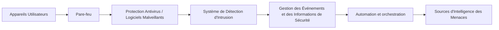

`**Ce texte fait partie d'un programme global d'automatisation visant à publier quotidiennement des articles sur l'architecture de développement de manière programmée, en utilisant OpenAI.**`

# Le $Système Immunitaire Numérique : Protéger Votre Monde Numérique

Dans le monde d'aujourd'hui, nous comptons plus que jamais sur la technologie. Que ce soit pour nos e-mails, nos réseaux sociaux, nos documents ou encore nos informations financières, tout est stocké dans nos appareils numériques. Cependant, cette facilité et cette commodité viennent avec leurs propres défis. Avec les menaces cybernétiques augmentant chaque jour, garder votre environnement numérique sûr et sécurisé est devenu absolument essentiel. C'est là que le $Système Immunitaire Numérique entre en jeu.

## Qu'est-ce que le $Système Immunitaire Numérique ?

Tout comme notre système immunitaire protège notre corps contre les virus et les infections, le $Système Immunitaire Numérique (DIS) est un ensemble de technologies et de processus qui combine pour protéger votre monde numérique. Il englobe tout, de la sécurité réseau à la protection antivirus, en passant par les mises à jour de logiciels, les pare-feu et bien plus encore.

Le DIS est conçu pour protéger et surveiller tous les aspects de votre environnement numérique, des ordinateurs portables personnels aux infrastructures de réseau de niveau entreprise. Il utilise diverses techniques pour détecter et prévenir toute activité malveillante, telle que les escroqueries de phishing, les logiciels malveillants, les rançongiciels ou les tentatives de piratage.

Le DIS fonctionne en analysant régulièrement tout le trafic entrant et sortant et en bloquant activement toute activité suspecte ou malveillante avant qu'elle ne cause des dommages. Il peut également détecter et vous alerter en cas de violations ou de violations de sécurité, vous permettant de prendre des mesures immédiates.

## L'Architecture du $Système Immunitaire Numérique

Pour vous aider à comprendre comment le DIS fonctionne à un niveau fondamental, examinons son diagramme d'architecture.

En bref, l'architecture se compose de plusieurs couches de contrôles de sécurité qui travaillent ensemble pour protéger votre environnement numérique. La première est la couche des appareils, où les appareils des utilisateurs (ordinateurs portables, smartphones, etc.) sont connectés via un pare-feu, qui agit comme un bouclier contre toute tentative d'accès non autorisé.

La couche suivante comprend la protection antivirus et antilogiciels malveillants, servant de barrière contre tout logiciel malveillant tentant de s'infiltrer dans vos appareils. Le système de détection d'intrusion (IDS) la complète en analysant les paquets d'entrée et de sortie pour toute activité anormale, déclenchant des alertes si nécessaire.

Le système de gestion des événements et des informations de sécurité collecte ensuite ces informations et fournit une vue centralisée des risques de sécurité potentiels. La couche d'automatisation et d'orchestration automatise la réponse à ces risques, garantissant que même avant l'intervention de l'équipe de cybersécurité, des contre-mesures automatisées sont déjà en place.

Enfin, la couche de sources d'intelligence des menaces fournit des mises à jour régulières sur les dernières tendances et modèles de menaces, aidant le DIS à évoluer et à s'adapter aux nouvelles techniques et stratégies.

## Que peut faire le $Système Immunitaire Numérique pour vous ?

Avoir un DIS solide est essentiel pour protéger votre environnement numérique. Il peut aider de plusieurs manières, notamment :

- Réduire le risque d'attaques cybernétiques et de violations de données
- Améliorer la détection et la réponse à toute tentative de menace ou de violation
- Fournir une plateforme centralisée pour la surveillance et la gestion de votre paysage de sécurité numérique
- Des mises à jour régulières et des améliorations pour répondre aux tendances et modèles de cybersécurité en constante évolution

En conclusion, dans cette ère numérique, nous ne devons pas négliger l'importance de la sécurité numérique. Le DIS est un outil crucial pour garantir que notre monde numérique reste sûr et sécurisé. En adoptant une approche complète et multi-couches, nous pouvons réduire considérablement les risques de menaces cybernétiques potentielles et protéger nos actifs numériques.