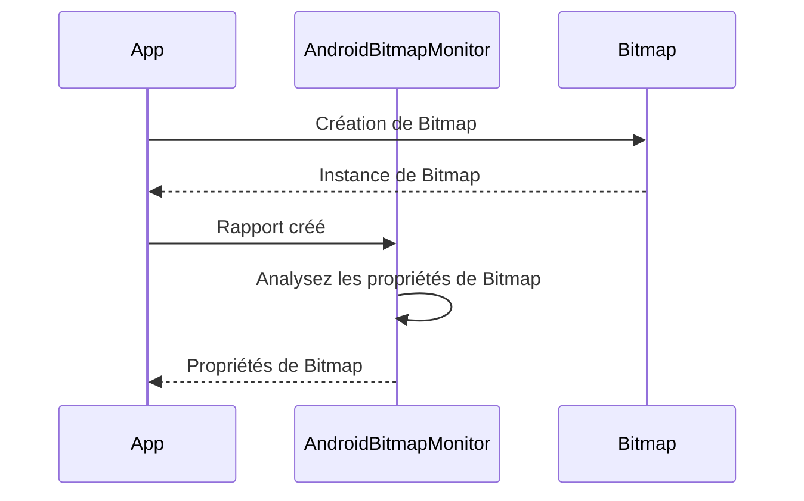

# Analyse de l'utilisation des images Bitmap dans Android avec AndroidBitmapMonitor

Êtes-vous fatigué de publier des applications qui sont lentes ou qui occupent trop de mémoire? L'un des principaux coupables de ces problèmes est une mauvaise manipulation des images Bitmap. Heureusement, il existe un outil qui peut vous aider à analyser et à optimiser votre utilisation des Bitmap dans les applications Android: AndroidBitmapMonitor.

## Architecture

Voici un organigramme simplifié de la façon dont AndroidBitmapMonitor fonctionne:



Lorsque votre application crée un Bitmap, AndroidBitmapMonitor reçoit un rapport de la création de l'image. Il analyse ensuite les propriétés de l'image, telles que ses dimensions et son format de pixel. Le moniteur peut ensuite transmettre un rapport à votre application, vous aidant ainsi à optimiser l'utilisation des Bitmap.

## Comment utiliser AndroidBitmapMonitor

L'utilisation d'AndroidBitmapMonitor est très simple. Tout d'abord, ajoutez les dépendances suivantes dans le fichier `build.gradle` de votre projet:

```
dependencies {
    debugImplementation 'com.github.shixinzhang.AndroidBitmapMonitor:monitor:1.1.0'
    releaseImplementation 'com.github.shixinzhang.AndroidBitmapMonitor:noop:1.1.0'
}
```

Ensuite, vous devez initialiser le moniteur dans la classe `Application` de votre application:

```java
public class MyApplication extends Application {
    @Override
    public void onCreate() {
        super.onCreate();
        AndroidBitmapMonitor.initialize(this);
    }
}
```

Maintenant, chaque fois que votre application crée un Bitmap, AndroidBitmapMonitor recevra un rapport de la création.

Pour gérer les rapports, implémentez un `BitmapReportListener` dans votre code:

```java
AndroidBitmapMonitor.getInstance().addBitmapReportListener(new BitmapReportListener() {
    @Override
    public void onBitmapReport(BitmapReport report) {
        // Gérez le rapport ici
    }
});
```

Vous pouvez ensuite utiliser les informations du rapport pour optimiser l'utilisation des Bitmap de votre application.

## Conclusion

En conclusion, AndroidBitmapMonitor est un outil incroyablement utile pour optimiser l'utilisation des Bitmap dans les applications Android. En surveillant la création des Bitmap et en analysant leurs propriétés, cet outil peut vous aider à réduire l'utilisation de la mémoire et améliorer les performances de votre application. Alors pourquoi ne pas l'essayer et voir comment il peut bénéficier à votre processus de développement d'applications?