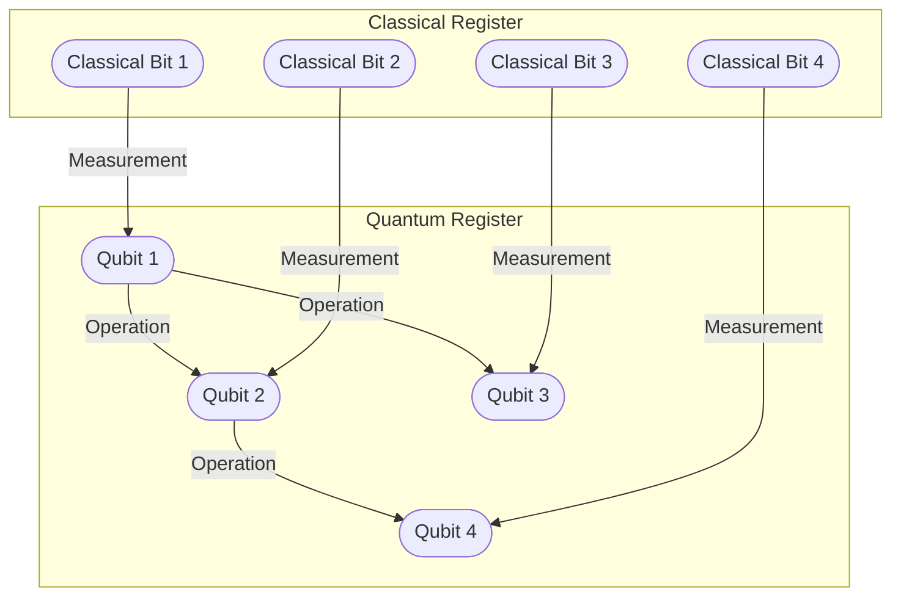

<article>

**`Ce texte fait partie d'un programme global d'automatisation visant à publier quotidiennement des articles sur l'architecture de développement de manière programmée, en utilisant OpenAI.`**

# Informatique quantique : l'avenir de l'informatique

Le monde de l'informatique a toujours été axé sur la vitesse et l'efficacité. L'informatique quantique est le niveau suivant, au-delà de l'informatique classique. Elle utilise des bits quantiques ou qubits au lieu de bits, ce qui la rend beaucoup plus puissante et plus rapide.

## Qu'est-ce que l'informatique quantique ?

L'informatique quantique est un type d'informatique qui utilise des principes de mécanique quantique, tels que la superposition et l'entrelacement, pour effectuer des calculs plus rapides et plus efficaces que l'informatique classique. Les qubits, contrairement aux bits, peuvent exister dans une superposition d'états, permettant à l'ordinateur de traiter plusieurs entrées à la fois.

Dans l'informatique classique, les données sont stockées sous forme binaire, soit 0 soit 1. Dans l'informatique quantique, les qubits peuvent exister à la fois sous 0 et 1. Cela permet aux ordinateurs quantiques de traiter et d'analyser simultanément de grandes quantités de données et de résoudre des problèmes complexes que les ordinateurs classiques ne peuvent pas résoudre.

## Comment l'informatique quantique est-elle différente ?

L'informatique quantique est différente de l'informatique classique à bien des égards.

- Vitesse : Les ordinateurs quantiques peuvent traiter plusieurs calculs simultanément, augmentant la vitesse de manière exponentielle.
- Puissance : La capacité à traiter de plus grandes quantités de données avec des algorithmes plus complexes, permettant de résoudre des problèmes que les ordinateurs classiques ne peuvent pas résoudre.
- Efficacité : L'informatique quantique nécessite beaucoup moins de ressources pour obtenir les mêmes résultats que l'informatique classique.
- Sécurité : L'informatique quantique peut générer des nombres totalement aléatoires, utiles en cryptographie.

## Applications de l'informatique quantique

L'informatique quantique a un large éventail d'applications, dont beaucoup sont encore en cours de recherche et de développement. Certaines des applications potentielles comprennent :

- Cryptographie : Les ordinateurs quantiques peuvent briser de nombreux méthodes de cryptage actuelles, mais ils peuvent également créer de nouveaux algorithmes de cryptage inviolables.
- Apprentissage automatisé : Les ordinateurs quantiques peuvent traiter les données plus rapidement, permettant de meilleurs modèles d'apprentissage automatisé plus précis.
- Découverte de médicaments et de matériaux : L'informatique quantique peut calculer les interactions moléculaires précises qui conduisent aux réactions chimiques, ouvrant des possibilités pour une découverte de médicaments plus rapide et une ingénierie des matériaux.
- Modélisation financière : Les ordinateurs quantiques peuvent gérer des modèles et des simulations financières complexes, permettant aux entreprises de prendre de meilleures décisions.

## L'avenir de l'informatique quantique

L'informatique quantique est encore au stade initial de son développement, mais elle a le potentiel d'être l'avenir de l'informatique. De nombreux géants de la technologie tels qu'IBM, Google et Microsoft investissent massivement dans la recherche et le développement quantiques.

L'architecture d'un ordinateur quantique est complexe et varie selon le type de technologie quantique utilisé, tels que le supraconducteur, le piégeage ionique ou le topologique. Cependant, un exemple simple de l'architecture de haut niveau en utilisant Mermaid peut être vu ci-dessous :

L'avenir de l'informatique quantique est encore inconnu, mais il est clair qu'elle pourrait améliorer considérablement de nombreux aspects de notre vie. Les possibilités sont infinies et continueront de croître à mesure que la technologie évolue.

# Conclusion

L'informatique quantique est un domaine prometteur et passionnant de l'informatique avec de nombreuses applications potentielles. Elle a le potentiel de révolutionner la façon dont nous traitons les données et résolvons les problèmes. À mesure que les recherches se poursuivent, nous pourrions voir des ordinateurs quantiques utilisés dans des domaines tels que la finance, la médecine et la cryptographie. Bien qu'elle soit encore à ses débuts, l'avenir de l'informatique quantique semble prometteur.

Si vous voulez en savoir plus sur l'informatique quantique, consultez l' [IBM Q Experience](https://www.ibm.com/quantum-computing/) , qui vous permet d'expérimenter avec un véritable ordinateur quantique grâce à une interface Web.

</article>
