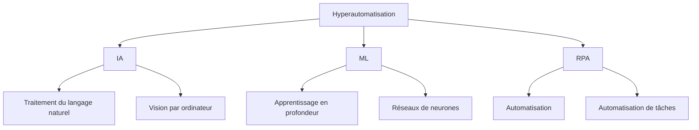
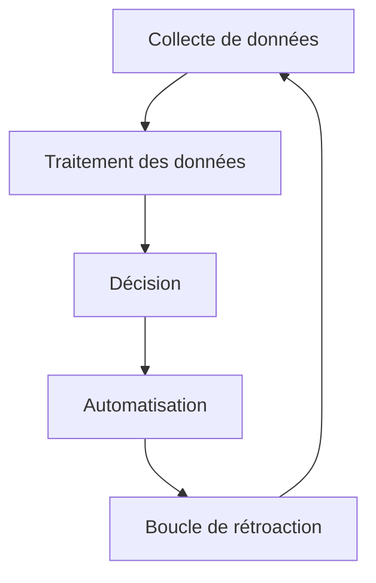

**`Ce texte fait partie d'un programme global d'automatisation visant à publier quotidiennement des articles sur l'architecture de développement de manière programmée, en utilisant OpenAI.`**

<article>

---

## Comprendre l'hyperautomatisation

Le terme "hyperautomatisation" gagne en popularité dans le monde de la technologie d'entreprise. Mais qu'est-ce que cela signifie exactement?

L'hyperautomatisation est la combinaison de plusieurs technologies telles que l'Intelligence Artificielle (IA), l'apprentissage automatique (ML), l'automatisation des processus robotiques (RPA) et d'autres processus automatisés. Le but de l'hyperautomatisation est d'automatiser autant de processus que possible pour augmenter l'efficacité et la productivité d'une entreprise. En d'autres termes, c'est l'automatisation à l'extrême.

Comme on peut le voir dans le diagramme ci-dessus, l'hyperautomatisation se compose de trois composants principaux - l'IA, l'apprentissage automatique et l'automatisation des processus robotiques.

### IA

L'IA aide les entreprises à automatiser des tâches qui nécessitent des capacités cognitives. Le traitement du langage naturel (NLP) est une branche de l'IA qui permet aux ordinateurs de comprendre et d'interpréter le langage humain. Les applications de NLP comprennent les chatbots, les assistants vocaux et l'analyse de sentiment.

La vision par ordinateur alimentée par l'IA implique des algorithmes avancés qui permettent aux machines de reconnaître, de comprendre et de répondre aux données visuelles. Avec l'IA, les entreprises peuvent automatiser des tâches telles que la reconnaissance d'objet, l'analyse d'image et de vidéo, et bien plus encore.

### Apprentissage automatique

L'apprentissage automatique est un sous-ensemble de l'IA qui permet aux machines d'apprendre à partir de données et d'améliorer leur précision au fil du temps. L'apprentissage en profondeur est un type d'apprentissage automatique qui se concentre sur la formation de réseaux de neurones avec de grandes quantités de données. L'apprentissage automatique peut également être utilisé dans la modélisation prédictive, la détection d'anomalies et d'autres cas d'utilisation.

### RPA

RPA est une technologie logicielle qui automatise les tâches basées sur des règles. Cela peut inclure des tâches telles que la saisie de données, le traitement de documents, et bien plus encore. Avec RPA, les entreprises peuvent décharger ces tâches aux bots, libérant ainsi les employés pour se concentrer sur des tâches plus complexes.

---

## Pourquoi l'hyperautomatisation est-elle importante?

L'hyperautomatisation est importante car elle permet aux organisations d'automatiser plus de processus, avec une vitesse et une précision plus importantes que jamais auparavant. Cela peut entraîner des économies de coûts significatives, une productivité accrue et de meilleures expériences client. Dans l'environnement commercial hautement concurrentiel d'aujourd'hui, les organisations qui peuvent atteindre ces avantages seront celles qui réussiront.

---

## Comment fonctionne l'hyperautomatisation?

L'hyperautomatisation fonctionne en créant un jumeau numérique des processus d'une organisation, à la fois en front-end et en back-end. Ce jumeau peut ensuite être optimisé et rationalisé à l'aide de l'IA et de l'apprentissage automatique afin de rendre les processus plus efficaces et plus efficaces.
Voici un exemple: Disons que vous travaillez dans une banque et que votre travail consiste à traiter les demandes de prêt. Avec l'hyperautomatisation, un jumeau numérique du processus de demande de prêt serait créé, comprenant toutes les étapes, règles et approbations requises. Les algorithmes d'IA et d'apprentissage automatique seraient alors utilisés pour optimiser ce processus, le rendant plus rapide et plus précis que ce qu'un être humain pourrait jamais réaliser.

Pour avoir une meilleure idée de ce à quoi ressemble l'hyperautomatisation en action, examinons un diagramme simple:

Dans ce diagramme, nous pouvons voir les différentes étapes du processus d'hyperautomatisation. Tout d'abord, les données sont collectées (A), puis traitées (B) à l'aide d'algorithmes d'IA et d'apprentissage automatique. Ces données sont ensuite utilisées pour prendre des décisions (C) sur les processus à automatiser (D). Enfin, les commentaires sont collectés (E) pour optimiser et améliorer davantage le processus d'automatisation.

---

## Conclusion

L'hyperautomatisation est l'avenir du travail, car elle permet aux organisations d'automatiser plus de processus, plus rapidement et plus précisément que jamais auparavant. Avec la puissance de l'IA et de l'apprentissage automatique, les entreprises peuvent réaliser des économies de coûts significatives, une productivité accrue et une expérience client améliorée. Ainsi, la prochaine fois que vous entendrez quelqu'un parler d'hyperautomatisation, vous saurez exactement ce qu'il veut dire!

</article>
