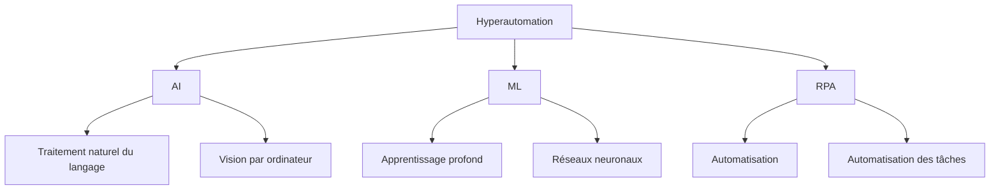
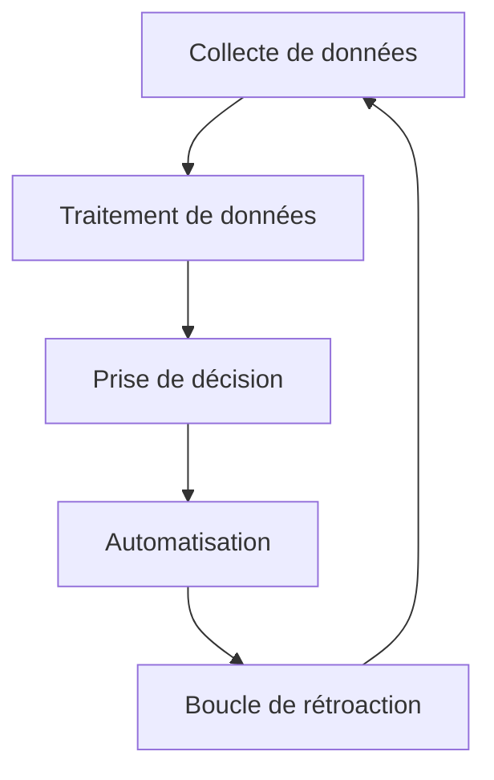

**`Ce texte fait partie d'un programme global d'automatisation visant à publier quotidiennement des articles sur l'architecture de développement de manière programmée, en utilisant OpenAI.`**

<article>

# Comprendre l'Hyperautomation

Le terme "hyperautomation" gagne en popularité dans le monde des technologies d'entreprise. Mais que signifie-t-il exactement?

L'hyperautomation est la combinaison de plusieurs technologies telles que l'Intelligence Artificielle (IA), l'Apprentissage Automatique (ML), l'Automatisation de Processus Robotiques (RPA) et d'autres processus automatisés. L'objectif de l'hyperautomation est d'automatiser autant de processus que possible pour augmenter l'efficacité et la productivité d'une entreprise. En d'autres termes, c'est l'automatisation à l'extrême.

Comme le montre le diagramme ci-dessus, l'hyperautomation se compose de trois composants principaux - l'IA, le ML et le RPA.

### IA

L'IA aide les entreprises à automatiser les tâches qui nécessitent des capacités cognitives. Le traitement naturel du langage (NLP) est une branche de l'IA qui permet aux ordinateurs de comprendre et d'interpréter le langage humain. Les applications de NLP comprennent les chatbots, les assistants vocaux et l'analyse de sentiment.

La vision par ordinateur alimentée par l'IA implique des algorithmes avancés qui permettent aux machines de reconnaître, de comprendre et de répondre aux données visuelles. Avec l'IA, les entreprises peuvent automatiser des tâches telles que la reconnaissance d'objets, l'analyse d'images et de vidéos, et plus encore.

### ML

ML est un sous-ensemble de l'IA qui permet aux machines d'apprendre à partir de données et d'améliorer leur précision avec le temps. L'apprentissage profond est un type de ML qui se concentre sur la formation de réseaux neuronaux avec de grandes quantités de données. Le ML peut également être utilisé dans des modèles prédictifs, la détection d'anomalies et d'autres cas d'utilisation.

### RPA

Le RPA est une technologie logicielle qui automatise les tâches répétitives basées sur des règles. Cela peut inclure des tâches telles que la saisie de données, le traitement de documents, et plus encore. Avec le RPA, les entreprises peuvent décharger ces tâches sur des bots, libérant des employés pour se concentrer sur des tâches plus complexes.

## Pourquoi l'Hyperautomation est-elle importante?

L'hyperautomation est importante car elle permet aux organisations d'automatiser plus de processus, avec une vitesse et une précision plus élevées que jamais auparavant. Cela peut conduire à des économies de coûts importantes, une productivité accrue et de meilleures expériences pour les clients. Dans l'environnement commercial hautement compétitif d'aujourd'hui, les organisations qui peuvent atteindre ces avantages seront celles qui réussiront.

## Comment fonctionne l'Hyperautomation?

L'hyperautomation fonctionne en créant une réplique numérique des processus d'une organisation, à la fois en front-end et en back-end. Ce jumeau peut ensuite être optimisé et rationalisé à l'aide de l'IA et de l'apprentissage automatique afin de rendre les processus plus efficaces et plus efficaces.

Voici un exemple: disons que vous travaillez dans une banque et que votre travail consiste à traiter les demandes de prêt. Avec l'hyperautomation, une réplique numérique du processus de demande de prêt serait créée, y compris toutes les étapes, règles et approbations requises. Des algorithmes d'IA et d'apprentissage automatique seraient ensuite utilisés pour optimiser ce processus, le rendant plus rapide et plus précis qu'un humain ne le pourrait jamais.

Pour avoir une meilleure idée de ce que ressemble l'hyperautomation en action, jetons un coup d'œil à un diagramme simple:

Sur ce diagramme, nous pouvons voir les différentes étapes du processus d'hyperautomation. Tout d'abord, les données sont collectées (A) puis traitées (B) à l'aide d'algorithmes d'IA et d'apprentissage automatique. Ces données sont ensuite utilisées pour prendre des décisions (C) sur les processus à automatiser (D). Enfin, des commentaires sont recueillis (E) pour optimiser et améliorer davantage le processus d'automatisation.

## Conclusion

L'hyperautomation est l'avenir du travail, car elle permet aux organisations d'automatiser plus de processus, plus rapidement et avec une précision plus élevée que jamais auparavant. Avec la puissance de l'IA et de l'apprentissage automatique, les entreprises peuvent réaliser des économies de coûts importantes, une productivité accrue et une meilleure expérience client. Ainsi, la prochaine fois que vous entendrez quelqu'un parler d'hyperautomation, vous saurez exactement ce qu'il veut dire!

</article> 