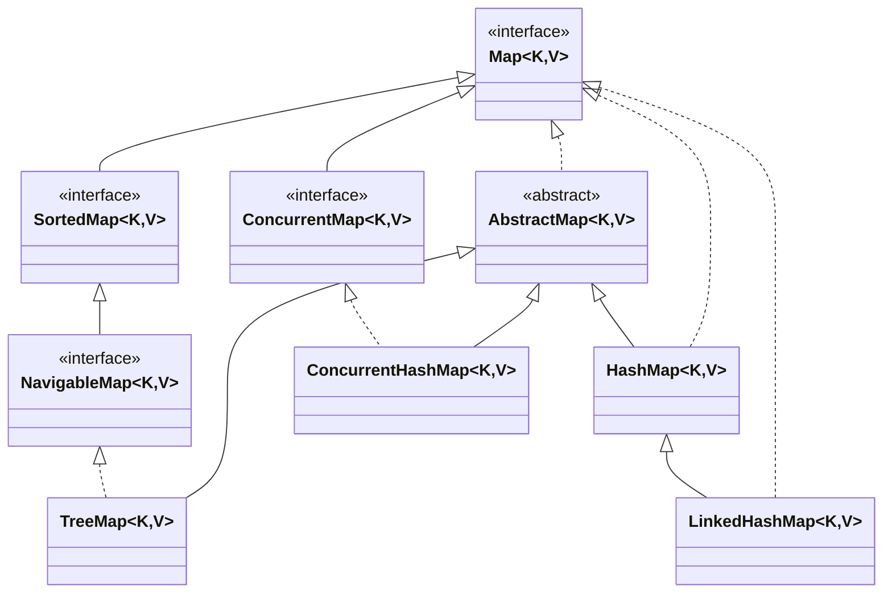

<article>

- [Présentation](#présentation)
  - [Pourquoi et quand utiliser une Maps?](#pourquoi-et-quand-utiliser-une-maps)
  - [Caractéristique d'une Map](#caractéristique-dune-map)
    - [Methodes disponible à partir de l'interface Map](#methodes-disponible-à-partir-de-linterface-map)
- [Différences](#différences)
  - [HashMap](#hashmap)
  - [LinkedHashMap](#linkedhashmap)
  - [TreeMap](#treemap)
  - [ConcurrentHashMap](#concurrenthashmap)

---

## Présentation

### Pourquoi et quand utiliser une Maps?

Les maps sont parfaites pour le `mappage d'association clé-valeur` tel que les `dictionnaires`. Les maps sont utilisées pour effectuer des recherches par clés ou lorsque l'on veut récupérer et mettre à jour des éléments par leur clés.

### Caractéristique d'une Map

1. Une map n'a `pas de duplication de clé` et `chaque clé peut correspondre au plus une valeur`. Certaines implémentations autorisent une clé nulle et des valeurs nulles comme HashMap, LinkedHashMap, ConcurrentHashMap, mais d'autres non, comme TreeMap.
2. L'ordre d'une map dépend des implémentations spécifiques. Par exemple, `TreeMap et LinkedHashMap ont des ordres prévisibles`, alors que `HashMap et ConcurrentHashMap n'en ont pas`.
3. Il existe `trois interfaces` pour implémenter Map en Java. Il s'agit de **Map**, **SortedMap** et **ConcurrentMap**, et de `quatre classes` : **HashMap**, **TreeMap**, **LinkedHashMap** et **ConcurrentHashMap**.

#### Methodes disponible à partir de l'interface Map

| Méthode | Action effectuée |
| --- | --- |
| **clear**() | Efface et supprime tous les éléments ou mappages d'une collection Map spécifiée. |
| **containsKey**(Object) | Vérifie si une clé particulière est mappée dans la Map ou non. Il prend l'élément clé en paramètre et renvoie `true` si cet élément est mappé dans la map. |
| **containsValue**(Object) | Vérifie si une valeur particulière est mappée par une ou plusieurs clés dans la Map. Il prend la valeur en paramètre et renvoie `true` si cette valeur est mappée par n'importe quelle clé dans la map. |
| **entrySet**() | Crée un ensemble à partir des mêmes éléments contenus dans la map. Il renvoie essentiellement une vue d'ensemble de la map ou nous pouvons créer un nouvel ensemble et stocker les éléments de la map en eux. |
| **equals**(Object) | Vérifie l'égalité entre deux maps. Il vérifie si les éléments d'une map passée en paramètre sont égaux aux éléments de cette map ou non. |
| **get**(Object) | Récupère ou extrait la valeur mappée par une clé particulière mentionnée dans le paramètre. Il renvoie `null` lorsque la map ne contient pas de tel mappage pour la clé. |
| **hashCode**() | Génère un hashCode pour la map donnée contenant des clés et des valeurs. |
| **isEmpty**() | Vérifie si une map a une entrée pour des paires clé-valeur. Si aucun mappage n'existe, alors cela renvoie `true`. |
| **keySet**() | Renvoie une vue Set des clés contenues dans cette map. L'ensemble est soutenu par la map, donc les modifications de la map se reflètent dans l'ensemble, et vice-versa. |
| **put**(Object, Object) | Associe la valeur spécifiée à la clé spécifiée dans cette map. |
| **putAll**(Map) | Copie tous les mappages de la map spécifiée dans cette map. |
| **remove**(Object)  | Supprime le mappage d'une clé de cette map si elle est présente dans la map. |
| **size**() | Renvoie le nombre de paires clé/valeur disponibles dans la map. |
| **values**() | Crée une collection à partir des valeurs de la map. Il renvoie essentiellement une vue Collection des valeurs dans la HashMap. |
| **getOrDefault**(Object key, V defaultValue) | Renvoie la valeur à laquelle la clé spécifiée est mappée, ou defaultValue si cette map ne contient pas de mappage pour la clé. |
| **merge**(K key, V value, BiFunction<? super V,? super V,? extends V> remappingFunction) | Si la clé spécifiée n'est pas déjà associée à une valeur ou est associée à `null`, l'associe à la valeur non-null donnée. |
| **putIfAbsent**(K key, V value) | Si la clé spécifiée n'est pas déjà associée à une valeur (ou est mappée à `null`) l'associe à la valeur donnée et renvoie `null`, sinon renvoie la valeur courante. |

---

## Différences

`Map` est le type d'interface de la map, tandis que `HashMap`, `LinkedHashMap`, `TreeMap` et `ConcurrentHashMap` sont le type d'implémentation de la map.
Cela signifie que le compilateur traitera l'objet map comme étant de type Map, même si au moment de l'exécution, il peut pointer vers n'importe quel sous-type de celui-ci.

### HashMap

HashMap fait partie de la collection de Java depuis Java 1.2. Il fournit l'implémentation de base de l'interface Map de Java. Il stocke les données dans des paires (clé, valeur). Pour accéder à une valeur, il faut connaître sa clé. Cette classe utilise une technique appelée `hachage`. Le hachage est une technique de conversion d'une grande chaîne de charactère en une petite chaîne de charactère qui représente la même valeur. Une valeur plus courte permet une `indexation et des recherches plus rapides`. HashMap a fourni l'avantage d'une `insertion, d'une recherche et d'une suppression rapides`.

### LinkedHashMap

LinkedHashMap est comme HashMap, avec une fonctionnalité supplémentaire de `maintien de l'ordre d'insertion des éléments`.

### TreeMap

La map est triée selon le constructeur utilisé soit `triée selon l'ordre naturel de ses clés`, soit `triée par un comparateur fourni au moment de la création de la map`. Cela s'avère être un moyen efficace de trier et de stocker les paires clé-valeur.

### ConcurrentHashMap

La classe ConcurrentHashMap est similaire à HashMap, sauf qu'elle est `thread-safe` et `synchronisée` (HashMap peut être thread-safe avec une synchronisation externe comme Collections.synchornizedMap) et `permet la modification pendant l'itération` (un HashMap lance une ConcurrentModificationException lorsqu'un autre thread essayez d'ajouter/modifier le contenu de l'objet).
D'une manière générale, il est `plus performant et plus évolutif dans un contexte avec thread` et dans des utilisations spécifiques comme lorsqu'un nombre de threads de lecture dépassent le nombre de threads d'écriture (scénario de cache, ...)

---

références externes:

- [geeksforgeeks](https://www.geeksforgeeks.org/map-interface-java-examples/)

</article>
