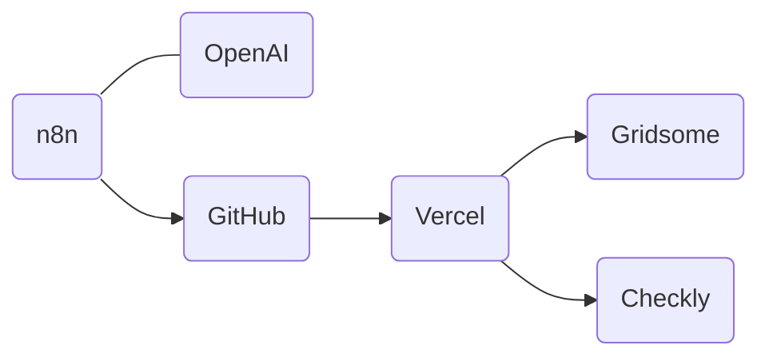
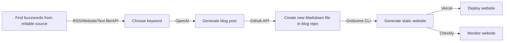
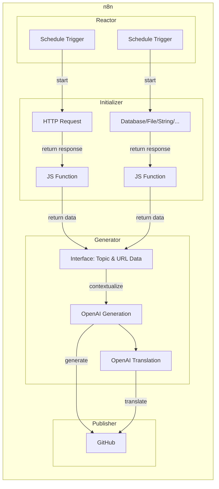

## OpenAI et n8n, les outils d'automatisation parfaits pour l'écriture d'article de blog


Lorsque l'on écrit des articles et que l'on gère son blog quotidiennement, cela prend du temps. Je vais vous présenter comment tirer profit de l'automatisation avec n8n et OpenAI pour écrire des articles de blog automatiquement et de manière régulière. Ce processus fait gagner un temps considérable et permet par exemple de publier régulièrement des articles sur des sujets novateurs qui se mettent parfois à jour plus rapidement que ce que nous pouvons rédiger manuellement. L'objectif de cet article n'est pas de fournir une méthode pas à pas pour l'installation et la configuration, mais plutôt de donner une idée générale de ce que l'on peut faire avec ces outils.

### Présentation de la stack

Voici une liste des outils que j'utilise pour automatiser l'écriture d'article de blog :



- Services d'automatisation
  - [n8n.io](https://n8n.io/): permet de connecter visuellement les applications entre elles, solution autohébergée ou en SaaS
  - [OpenAI](https://openai.com/): générateur de texte, solution SaaS

- Infrastructure du blog
  - [Gridsome](https://gridsome.org/): générateur de site web statique pour Vue.js
  - [GitHub](https://github.com/): hébergement du code source et versionning, solution SaaS
  - [Vercel](https://vercel.com): hébergement du site web généré lors du push d'un commit vers Github, solution SaaS
  - [Checkly](https://www.checklyhq.com/): monitoring de la performance du site web, tests d'intégration continue, principalement utilisé lors du build avec Vercel, solution SaaS

Très bien, commençons les présentations !

#### Services d'automatisation

<div style="float: left; margin-right: 1em; padding: 1em; width: 10em; background-color: white; border-radius: 10px; text-align: center;">

</div>

**n8n** est une plateforme d'automatisation qui permet de connecter différentes applications entre elles pour automatiser des tâches récurrentes. Avec n8n, vous pouvez créer des workflows d'automatisation en utilisant des nœuds préfabriqués ou en créant vos propres nœuds personnalisés. Cette solutions peux être autohébergée ou en SaaS. C'est ce que j'utilise pour automatiser l'écriture d'article de blog.

<div style="float: left; margin-right: 1em; padding: 1em; width: 10em; background-color: white; border-radius: 10px; text-align: center;">

</div>

De son côté, **OpenAI** est une entreprise de recherche en intelligence artificielle qui a développé des modèles de langage de pointe tels que GPT-3. Ces modèles peuvent être utilisés pour générer du texte, répondre à des questions, traduire des langues, etc. OpenAI propose également une API qui permet d'accéder à ces modèles. C'est ce que nous allons utiliser pour générer du contenu.

#### Infrastructure du blog

<div style="float: left; margin-right: 1em; padding: 1em; width: 10em; background-color: white; border-radius: 10px; text-align: center;">

</div>

Dans mon cas, je suis un blogueur utilisant la stack **Gridsome**, un générateur de site web statique pour Vue.js. Celui-ci va produire à partir de fichiers statiques Markdown contenant nos articles, une page HTML elle aussi statique. Cela signifie que notre site est rapide, sécurisé et facile à maintenir, sans avoir besoin d'une base de données ou d'un serveur web.

<div style="float: left; margin-right: 1em; padding: 1em; width: 10em; background-color: white; border-radius: 10px; text-align: center;">


</div>

Mon site est hébergé sur **GitHub**, ce qui nous permet de le versionner et de le partager facilement. J'ai choisi de déployer mon site sur **Vercel** pour une disponibilité en ligne 24/7. Vercel génère le site web statique à partir du code source lorsqu'un commit est poussé sur GitHub, ce qui permet de mettre à jour le site automatiquement et rapidement. Ce combo est parfait pour un blog, car il est facile à mettre en place et à maintenir tout en offrant une disponibilité maximale pour un coût minimal. Dans mon cas, c'est gratuit et plus performant que d'héberger le site sur un serveur personnel.

<div style="float: left; margin-right: 1em; padding: 1em; width: 10em; background-color: white; border-radius: 10px; text-align: center;">

</div>

J'utilise également **Checkly** pour surveiller les performances de notre site web, tester l'intégration continue et nous assurer que tout fonctionne correctement. Checkly nous permet de surveiller la vitesse de chargement de notre site, les erreurs de serveur, les temps de réponse, etc. Cela nous aide à résoudre rapidement les problèmes et à améliorer la qualité de notre site.

Maintenant que vous connaissez les outils que j'utilise, quelle idée je veux automatiser ?

### Idée générale du projet

Avant de passer au scénario d'automatisation, il est important de comprendre l'idée générale du projet. Voici les points clés à retenir :

- Dans les services d'automatisation :
  - n8n permet de connecter des applications entre elles
  - OpenAI permet de générer du texte
- Dans l'infrastructure du blog :
  - Gridsome utilise des fichiers Markdown pour générer le site web statique
  - Vercel déclenche un build à chaque commit sur GitHub pour déployer le site en ligne.

#### La cible

##### Diagramme d'état



Automatisation de l'écriture de blog en 7 étapes.

##### Explication

Notre processus d'automatisation de l'écriture de blog se déroule en 7 étapes, comme indiqué dans le diagramme ci-dessus :

1. À un moment fixe (par exemple tous les jours à 8h), nous trouvons un mot clé à partir d'une source fiable proposant des "buzzwords" pertinents pour notre blog, tels que des feeds RSS (Reddit, Hacker News, etc.), des sites web (crawling de sites web, etc.), des fichiers texte, des APIs (hashtags Twitter, topics ou repositories populaires, etc.).

2. Nous selectionnons le mot clé trouvé dans la liste des buzzwords

3. Nous utilisons le générateur de texte OpenAI pour générer un article de blog à partir de ce mot clé. Nous pouvons également demander au service de nous fournir la traduction de l'article préalablement généré en anglais pour avoir une expérience similaire à ce qui est déjà publié.

4. Nous utilisons l'API GitHub pour créer un nouveau fichier Markdown dans le dépôt de notre blog, avec le contenu de l'article généré.

5. Gridsome CLI génère ensuite le site web statique à partir du code source
  
6. Vercel le déploie sur ses serveurs et le rend disponible en ligne 24/7.

7. Checkly surveille le processus de transcription du Markdown généré en HTML pour s'assurer que tout se passe bien et que le site web est disponible.

#### Les difficultés

Le principal défi dans ce projet est de trouver une source fiable de "buzzwords". Pour résoudre ce problème, je vais commencer par utiliser une liste statique de mots clés, puis passer à une liste de repositories populaires sur GitHub, car je suis familier avec leur API.

Voici les sources que j'ai utilisées pour trouver des buzzwords pertinents :

- Pour la liste statique, j'ai trouvé la liste des buzzwords pour 2023 sur le site [datapine](https://www.datapine.com/blog/technology-buzzwords/).

- Pour la recherche de repositories sur GitHub, j'ai utilisé l'API suivante pour trouver les 10 repositories les plus populaires pour les langages de programmation les plus courants (Java, JavaScript, Go, Python) :

    ```curl
    curl -H "Accept: application/vnd.github.v3+json" -X GET "https://api.github.com/search/repositories?q=+created:%22>2023-01-01%22+pushed:>2023-02-01+-topic:%22books%22+-topic:%22education%22+-topic:%22awesome%22+topics:>=1+language:java,javascript,go,python&sort=stars&order=desc&per_page=10"
    ```

En utilisant ces sources, je suis confiant de trouver des buzzwords pertinents pour mes articles de blog, et de les générer automatiquement avec OpenAI et n8n.

### Scénario d'automatisation

Maintenant que l'idée générale est posée et les difficultés identifiées, je vais commencer à travailler sur le scénario d'automatisation. Pour cela, j'utiliserai n8n.

Le workflow sera déclenché par un timer "Schedule Trigger" programmé chaque semaine. Voici les étapes du processus :

1. Le premier nœud sera soit un noeud de code avec une liste de mots clefs statique, soit un "HTTP Request" qui récupère la liste de buzzwords à partir de l'API de Github.

2. Le résultat du premier nœud sera ensuite simplifié avec un autre noeud de code pour fournir une sortie uniforme pour l'étape suivante.

3. Le noeud suivant "interface" fournira un objet de travail avec plusieurs champs (topic, url, ... ) à partir du mot clef récupéré, pour les étapes suivants (la partie génération OpenAI, github ...). Selon le nœud d'initialisation utilisé, cette étape pourra se faire soit avec la liste de mots clefs statique, soit avec la liste récupérée depuis l'API de Github.

4. Un nœud sera dédié à la récupération de l'article généré par OpenAI. Il utilisera l'API de OpenAI et le noeud "interface" pour récupérer le mot clef. Un autre noeud sera utilisé pour traduire l'article si nécessaire.

5. Enfin, pour chaque article généré, un nœud "GitHub" créera un nouveau fichier Markdown dans le dépôt du blog avec le contenu de l'article généré et les informations du noeud "interface".

#### Diagramme de flux



### n8n dans la pratique

Pour utiliser n8n efficacement et tirer le meilleur parti de cet outil d'automatisation, voici quelques conseils pratiques et des informations sur son utilisation en local ou en SaaS :

1. **Utilisation en local** : Pour commencer à utiliser n8n localement, installez-le sur votre ordinateur en suivant les instructions disponibles sur leur [documentation officielle](https://docs.n8n.io/getting-started/installation.html). Une fois installé, vous pouvez lancer n8n et accéder à l'interface utilisateur via votre navigateur web. L'utilisation en local est idéale pour expérimenter, tester et développer vos workflows d'automatisation avant de les déployer sur un environnement de production.

2. **Utilisation en SaaS** : Si vous préférez utiliser n8n en tant que service, vous pouvez opter pour leur offre [n8n.cloud](https://n8n.io/cloud). Cette solution hébergée vous permet de bénéficier de toutes les fonctionnalités de n8n sans avoir à gérer l'installation et la maintenance du logiciel. Elle est particulièrement adaptée aux entreprises et aux équipes qui souhaitent déployer rapidement des workflows d'automatisation sans se soucier de l'infrastructure sous-jacente.

3. **Conseils pratiques** :

    - **Documentation** : Prenez le temps de consulter la [documentation officielle de n8n](https://docs.n8n.io/) pour comprendre les concepts clés et les fonctionnalités de l'outil. Cela vous aidera à créer des workflows d'automatisation plus efficaces et à résoudre les problèmes éventuels.
    - **Communauté** : Rejoignez la [communauté n8n](https://community.n8n.io/) pour échanger avec d'autres utilisateurs, poser des questions, partager des idées et obtenir de l'aide pour résoudre les problèmes rencontrés.
    - **Sécurité et confidentialité** : Si vous travaillez avec des données sensibles, assurez-vous de suivre les meilleures pratiques en matière de sécurité et de confidentialité. Cela inclut l'utilisation de connexions sécurisées, la gestion des accès aux données et l'évaluation des risques associés à chaque workflow d'automatisation.
    - **Sauvegarde et versionnage** : N'oubliez pas de sauvegarder régulièrement vos workflows et de les versionner afin de pouvoir revenir en arrière en cas de problème ou de changement de stratégie. Vous pouvez utiliser des outils de gestion de versions comme Git pour suivre l'évolution de vos workflows et collaborer avec d'autres membres de votre équipe.
    - **Monitoring et maintenance** : Surveillez régulièrement la performance de vos workflows d'automatisation et effectuez les ajustements nécessaires pour garantir leur bon fonctionnement. N'hésitez pas à consulter les journaux d'exécution pour identifier les erreurs et les points d'amélioration.

En suivant ces conseils et en choisissant entre l'utilisation en local ou en SaaS en fonction de vos besoins, vous pourrez exploiter pleinement le potentiel de n8n pour automatiser vos tâches et optimiser vos processus.

#### Capture d'écran d'implémentation dans n8n

Nous avons ici un exemple de workflow d'automatisation qui génère des articles de blog à partir de sujets et de buzzwords sélectionnés, développer à partir du diagramme de flux précédent pour suivre la cible.

n8n permet de concevoir et d'implémenter un workflow d'automatisation visuellement et de manière intuitive. Dans cet exemple, on peut observer les différents nœuds et les connexions qui les relient, représentant les étapes successives du processus automatisé. Chaque nœud correspond à une action spécifique, comme l'extraction de données, la connexion à des services externes (openAI, gitHub) ou la manipulation d'informations.

J'ai tenter ici de nommé au mieux les nœuds pour que vous puissiez facilement comprendre le fonctionnement du workflow.

#### Exemple de configuration des noeuds

Un exemple de configuration des noeuds pour le workflow d'automatisation de génération d'articles de blog pour donner une idée de la façon dont cela fonctionne. N'hesitez pas à consulter la documentation officielle de n8n pour plus d'informations ou à me contacter pour plus de détails.

##### HTTP Request [GET github search repositories]

###### Parameters

- Method: GET

###### Content

```url
https://api.github.com/search/repositories?q= +created:>{{ new Date(new Date().getTime() - 3 * 28 * 24 * 60 * 60 * 1000).format('yyyy-MM-dd') }} +pushed:>{{ new Date(new Date().getTime() - 28 * 24 * 60 * 60 * 1000).format('yyyy-MM-dd') }} -topic:"algorithm" -topic:"algorithms" -topic:"interview" -topic:"certification" -topic:"books" -topic:"education" -topic:"awesome" -topic:"roadmap" -topic:"tutorials" -topic:"snippets" +topics:>=1 +language:java,javascript,go,python &sort=stars&order=desc &per_page=10
```

##### Code [randomize and format] 2

###### Parameters

- Method: GET

###### Content

```javascript
const randomIndex = Math.floor(Math.random() * $input.first().json.items.length);

return [{
  "topic": $input.first().json.items[randomIndex].full_name,
  "url": $input.first().json.items[randomIndex].html_url
}];
```

##### OpenAI [build an article about subject]

J'utilise le template par défaut, il est possible de passer par une requete HTTP custom pour avoir plus de contrôle sur les paramètres.

###### Parameters

- Resource: Chat/Text
- Operation: Complete
- Model: gpt-3.5-turbo
- Prompt
  - Role: User
- Simplify: true

###### Content

```markdown
You are a computer science blogger, senior architect in XXXX, a XXXX tech compagny, named XXXX. You love to explain and share your knowledge. 

Do an markdown article about this subject "${{ $node["Code [Interface]"].json["topic"] }}" with 500 words minimun.

Add link to subject "${{ $node["Code [Interface]"].json["url"] }}" if any.

Code, schemas/diagram (lowchart and sequence diagram of the architecture using  Mermaid) and short specific explanations as if you speak to a kid are greatly encoureaged.
```

##### GitHub [create file EN]

###### Parameters

- Resource: File
- Operation: Create
- Repository: XXXX
- File Path: content/posts/en/{{ new Date().format("yyyy-MM-dd") }}.md
- Commit Message: {{ new Date().format("yyyy-MM-dd") }}-EN.md

###### Content

```markdown
---
id: "{{ new Date().format("yyyy-MM-dd") }}_en"
title: "[OpenAI article] {{ $node["Code [Interface]"].json["topic"] }}"
description: "First view on {{ $node["Code [Interface]"].json["topic"] }}, generated by OpenAI"
date: {{ new Date().format("yyyy-MM-dd") }}
lang: en
published: false
relateTo:
- {{ new Date().format("yyyy-MM-dd") }}_fr
---

`**This article is part of a comprehensive automation program to automatically and programmatically post daily articles on development architecture, using OpenAI.**

{{ $json.message.content }}

```

### Ce qu'il reste à faire

Bien que l'automatisation de l'écriture d'articles de blog avec n8n et OpenAI puisse être un gain de temps considérable, il y a toujours des améliorations à apporter et des défis à relever. Voici quelques points à considérer pour améliorer et étendre ce système :

1. **Améliorer la sélection des mots clés** : Il est essentiel d'explorer d'autres sources de buzzwords et d'affiner les critères de sélection pour garantir la pertinence et la qualité des sujets abordés dans les articles générés.

2. **Optimiser la génération de texte** : Travailler sur la personnalisation des paramètres de l'API OpenAI pour obtenir des résultats plus cohérents et de meilleure qualité. Cela peut inclure l'ajustement des niveaux de créativité, la longueur du texte et l'incorporation de balises pour structurer le contenu. Ou tout simplement passer sur des solutions plus avancées comme GPT-4, ou d'autres API de génération de texte.

3. **Intégrer une vérification humaine** : Même si l'IA est très avancée, il est toujours bénéfique d'intégrer une étape de vérification humaine pour relire, éditer et valider le contenu avant publication. Cela pourrait être réalisé en ajoutant une étape d'approbation dans le processus d'automatisation. Sur ma solution de bloggin Gridsome, j'ai ajouté la possibilité d'avoir un frontmatters YAML pour chaque article, et je pourrais ajouter un champs "approved" pour valider l'article avant publication.

4. **Automatiser le référencement (SEO)** : Pour améliorer la visibilité des articles générés, il serait intéressant d'ajouter une étape d'automatisation pour optimiser le référencement des articles, en incluant des balises méta, des mots clés et des descriptions pertinentes.

5. **Gestion des médias** : Intégrer une solution pour la recherche et l'insertion d'images et de vidéos pertinentes dans les articles générés, tout en respectant les droits d'auteur et les licences associées.

6. **Analyse des performances** : Mettre en place un suivi des performances des articles générés automatiquement, en mesurant les indicateurs clés tels que le taux de rebond, le temps passé sur la page et le nombre de vues. Ces données peuvent être utilisées pour affiner davantage le processus d'automatisation et améliorer la qualité des articles générés. Une partie peux être déjà réalisé avec Vercel et Clicky.

### Outro

En conclusion, l'utilisation de n8n et OpenAI pour automatiser la rédaction d'articles de blog présente de nombreux avantages, notamment un gain de temps considérable et la possibilité de publier des articles sur des sujets novateurs de manière régulière. Bien sûr, cela ne produit pas un article parfait à 100%, mais cela peut être un excellent point de départ pour une ébauche. J'utilise souvent cette technique pour générer des idées d'article ou des introductions, et je les peaufine ensuite à la main.

En combinant les puissantes fonctionnalités de n8n en matière d'automatisation et les capacités impressionnantes des modèles de langage d'OpenAI, nous avons la possibilité de transformer notre processus de rédaction et de publication d'articles de blog. Cela nous permet de nous concentrer davantage sur l'amélioration du contenu, l'analyse des performances et l'engagement avec notre audience.

Pour vous donner un exemple concret, j'ai utilisé ce workflow pour générer un article sur l'hyperautomation, qui explique l'idée générale et démontre le fonctionnement de ce processus d'automatisation. Vous pouvez lire cet article [ici](https://exemple.com/hyperautomation-article).

Alors, n'hésitez pas à explorer ces outils et à intégrer l'automatisation dans votre propre processus de création de contenu. Vous pourriez être agréablement surpris par les résultats ... :D
