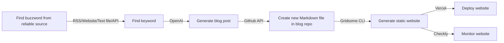
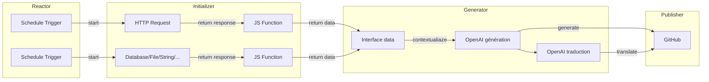

## openAI et n8n : Les outils d'automatisation parfaits pour l'écriture d'article de blog ! #dev

Je vais vour présenter comment tiré profit de l'automatisation avec n8n et openAI pour écrire des articles de blog. L'objectif de cet article n'est pas de fournir une méthode pas à pas pour installer, configurer, mais plutôt de fournir une idée générale de ce que l'on peut faire avec ces outils.

### Présentation de la stack

Voici une liste des outils que j'utilise pour automatiser l'écriture d'article de blog :

- Services d'automatisation
  - [n8n.io - a powerful workflow automation tool](https://n8n.io/): connecté visuellement les applications entre elles, solution autohébergé ou en SaaS
  - [OpenAI](https://openai.com/): générateur de texte, solution SaaS

- Infrastructure du blog
  - [Modern Site Generator for Vue.js - Gridsome](https://gridsome.org/): générateur de site web statique pour Vue.js
  - [GitHub: Let's build from here](https://github.com/): hébergement du code source et versionning
  - [Vercel: Develop. Preview. Ship. For the best frontend teams](https://vercel.com): hébergement du site web généré par build lors d'un commit Github, solution SaaS
  - [Checkly: Build and Run Synthetics That Scale](https://www.checklyhq.com/): monitoring de la performance du site web, test d'intégration continue, utiliser principalement lors du build avec Vercel solution SaaS

Très bien, commençons les présentations !

#### Services d'automatisation

**n8n** est une plateforme d'automatisation qui permet de connecter différentes applications entre elles pour automatiser des tâches récurrentes. Avec n8n, vous pouvez créer des workflows d'automatisation en utilisant des nœuds préfabriqués ou en créant vos propres nœuds personnalisés.

De son côté, **OpenAI** est une entreprise de recherche en intelligence artificielle qui a développé des modèles de langage de pointe tels que GPT-3. Ces modèles peuvent être utilisés pour générer du texte, répondre à des questions, traduire des langues, etc.

#### Infrastructure du blog

Dans mon cas, je suis un blogueur utilisant la stack **Gridsome** un générateur de site web statique pour Vue.js. Celui-ci va produire à partir de fichiers statiques Markdown contenant nos article, une page HTML elle aussi statique.

Mon site est hébergé sur **GitHub**, ce qui nous permet de le versionner et de le partager facilement et je l'ai déployé sur **Vercel** pour une disponibilité en ligne 24/7. Aussi Vercel génère le site web statique à partir du code source lorsqu'un commit est poussé sur GitHub.

J'utilise également **Checkly** pour surveiller les performances de notre site web, tester l'intégration continue et nous assurer que tout fonctionne correctement.

Maintenant que vous connaissez les outils que j'utilise, quelle idée je veux automatiser ?

### Idée générale du projet

Avant de passer au scénario d'automatisation, il est important de comprendre l'idée générale du projet. Ici, les seuls points qu'il faut retenir et qui nous intéresse pour ce projet :

- dans les services d'automatisation:
  - n8n permet de connecter des applications entre elles
  - OpenAI permet de générer du texte
- dans l'infrastructure du blog:
  - sont que Gridsome utilise du Markdown
  - Vercel déclenche un build à chaque commit sur GitHub.

#### La cible

##### Diagramme d'état



A déclenchement fixe, par exemple tous les jours à 8h, l'idée est de trouver un mot clef à partir d'une source fiable proposant des "buzzwords", des mots à la mode; le mieux est bien-sûr qu'il correspond à des sujets techs.

Ces sources peuvent être un feed RSS (Reddit, Hacker News ...), un site web (crawl de site web ...), un fichier texte (liste prédéfinie récupérée, créée de toute pièce, mise à disposition en statique sur Github, ...), un API (des hastags Twitter, des topics ou repositories au top, ...), etc.

Une fois le mot clef trouvé, il faut générer un article de blog à partir de ce mot clef. Pour cela, on peut utiliser un générateur de texte comme OpenAI. Je vais même pousser un peu plus loin en demandant au service de me produire la traduction de l'article préalablement généré en anglais pour avoir une expérience similaire à ce qui est déjà publié.

Ensuite, il faut utiliser l'API Github pour créer un nouveau fichier Markdown dans le dépôt du blog avec le contenu de l'article généré.

Puis, Vercel va générer le site web statique à partir du code source grâce à Gridsome CLI et le déployer sur ses serveurs. Checkly va surveiller que la transcription du markdown généré vers de l'HTML se passe bien et que le site web est disponible.

#### Les difficultés

Ce qui semble le plus dur dans ce projet est de trouver une source fiable de "buzzwords". J'ai déjà utilisé n8n et openAPI et je vois comment les utiliser.

Je vais donc commencer par chercher de ce côté là. Je vais me simplifier la vie dans un premier temps en partant sur une liste de mots clefs statiques, puis je partirai sur un liste des repositories les plus populaires sur Github, car je connais bien leur API.

- pour la liste statique: en cherchant rapidement je trouve la liste de buzzwords 2023 sur [datapine: 10 Tech & IT Buzzwords & Trends For 2023 You Cannot Avoid](https://www.datapine.com/blog/technology-buzzwords/).
- pour Github API:

  ```curl
  curl -H "Accept: application/vnd.github.v3+json" -X GET "https://api.github.com/search/repositories?q=+created:%22>2023-01-01%22+pushed:>2023-02-01+-topic:%22books%22+-topic:%22education%22+-topic:%22awesome%22+topics:>=1+language:java,javascript,go,python&sort=stars&order=desc&per_page=10"
  ```

### Scénario d'automatisation

Maintenant que l'idée générale est posée et les difficultés identifiées, je vais pouvoir commencer à travailler sur le scénario d'automatisation. Pour cela je vais utiliser n8n.

Je vais donc essayer de connecter les outils ci-dessus dans un workflow.

- le déclencheur sera un timer "Schedule Trigger" programmer sur chaque semaine.
- le premier nœud sera
  - soit un noeud de code avec une liste de mots clefs statique
  - soit "HTTP Request" qui va récupérer la liste de buzzwords à partir de l'API de Github
- un noeud de code (code2) pour simplifier ça sortie.
- le noeud suivant "interface" qui va fournir un objet sur lequel travail avec la partie génération OpenAPI, à partir d'un des deux nœuds d'initialisation précédents qui ont des sorties différentes.
- Un noeud sera dévoué pour récupérer l'article généré par OpenAI, il va utiliser l'API de OpenAI et le noeud "interface" pour récupérer le mot clef.
  - Un autre noeud traduira
- Ensuite un noeud "GitHub" par fichier générer va créer un nouveau fichier Markdown dans le dépôt du blog avec le contenu de l'article généré.

#### Diagramme de flux



#### Capture d'écran d'implémentation dans n8n

### Outro

Bien sûr, cela ne produit pas un article parfait à 100%, mais cela peut être un excellent point de départ pour une ébauche. J'utilise souvent cette technique pour générer des idées d'article ou des introductions, et je les peaufine ensuite à la main.
