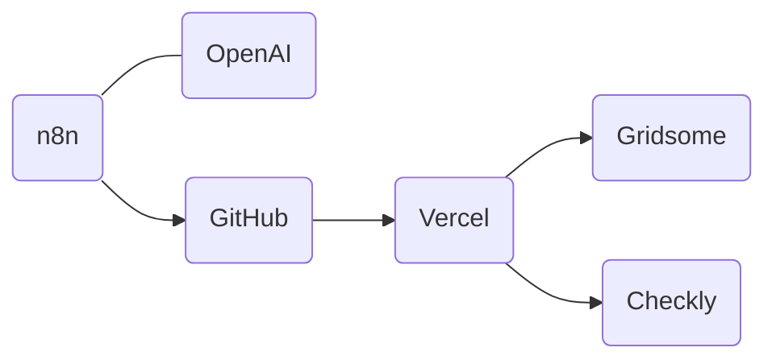
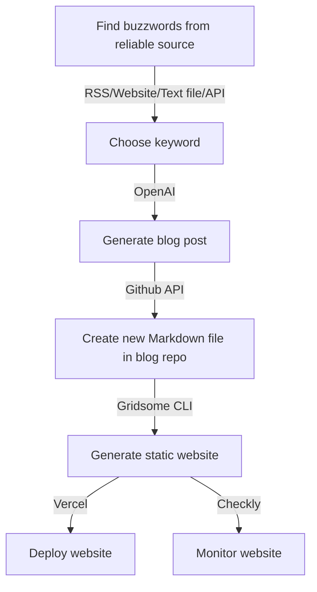
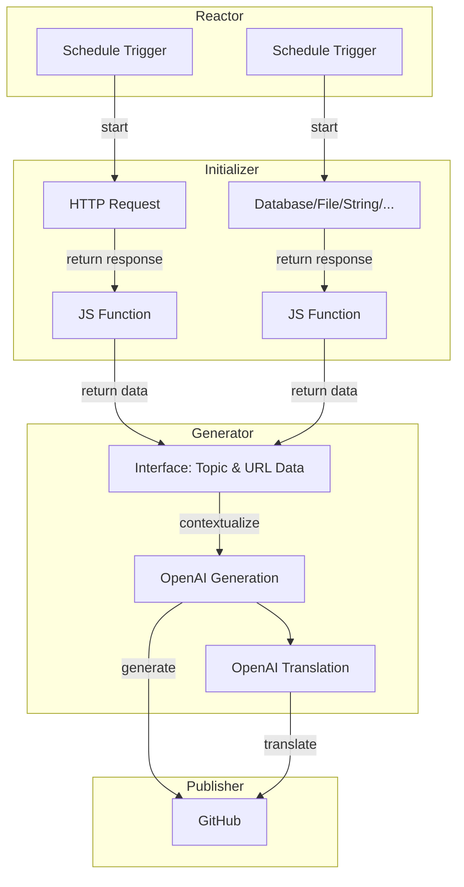

<article>


<div class="contenttable">

- [Présentation de la stack](#présentation-de-la-stack)
  - [Les as de l'automatisation](#les-as-de-lautomatisation)
  - [Le QG du blog](#le-qg-du-blog)
- [Le concept en deux mots](#le-concept-en-deux-mots)
  - [Le plan d'attaque](#le-plan-dattaque)
    - [Le diagramme d'état](#le-diagramme-détat)
    - [Le décodage](#le-décodage)
  - [Les embûches sur le chemin](#les-embûches-sur-le-chemin)
- [L'automatisation en action](#lautomatisation-en-action)
  - [n8n, la clé de l'automatisation](#n8n-la-clé-de-lautomatisation)
  - [Photo de famille de l'automatisation avec n8n](#photo-de-famille-de-lautomatisation-avec-n8n)
  - [Exemple de configuration des noeuds](#exemple-de-configuration-des-noeuds)
    - [HTTP Request \[GET github search repositories\]](#http-request-get-github-search-repositories)
      - [Parameters](#parameters)
      - [Content](#content)
    - [Code \[randomize and format\] 2](#code-randomize-and-format-2)
      - [Parameters](#parameters-1)
      - [Content](#content-1)
    - [OpenAI \[build an article about subject\]](#openai-build-an-article-about-subject)
      - [Parameters](#parameters-2)
      - [Content](#content-2)
    - [GitHub \[create file EN\]](#github-create-file-en)
      - [Parameters](#parameters-3)
      - [Content](#content-3)
- [Liste de choses à faire ou mieux faire](#liste-de-choses-à-faire-ou-mieux-faire)
- [En conclusion](#en-conclusion)

</div>

Rédiger des billets de blog et faire tourner la machine au quotidien, je peux vous dire que ça prend du temps. Mais j'ai une petite astuce à vous partager. J'ai découvert comment on peut dégainer le power-up de l'automatisation avec n8n et OpenAI pour produire des articles de blog tout seul, comme un grand et atteindre ce que l'on appel l'hyper-automatisation.

On parle ainsi d'une économie de temps monstre, et d'un moyen d'assurer une cadence de publication régulière sur des sujets aussi frais qu'un poisson à Tsukiji, qui évoluent parfois plus vite que notre capacité à taper sur le clavier.

Attention, le but du jeu ici n'est pas de vous donner un tutoriel complet pour l'installation et la configuration. Non, je veux juste vous teaser sur ce que l'on peut faire avec ces outils.

---

## Présentation de la stack

Et voilà la bande des super-héros qui me permettent d'automatiser la rédaction d'articles de blog :



- Généralissimes de l'automatisation
  - [n8n.io](https://n8n.io/): le marionnettiste qui va vous permettre de brancher visuellement vos applis, API entre elles, comme un puzzle.
  - [OpenAI](https://openai.com/): le Mozart de la génération de texte, en mode SaaS.
- Commando du blog
  - [Gridsome](https://gridsome.org/): le forgeron qui va transformer votre code en site web statique Vue.js.
  - [GitHub](https://github.com/): le coffre-fort de votre code, en mode SaaS, qui garde tout ça bien au chaud et vous permet de revenir en arrière en cas de problème.
  - [Vercel](https://vercel.com): l'as de la logistique, qui héberge votre site dès que vous poussez un commit vers Github, en mode SaaS.
  - [Checkly](https://www.checklyhq.com/): l'oeil de lynx qui surveille la performance de votre site et fait des tests d'intégration continue, surtout lors du build avec Vercel, en mode SaaS.

Allez, maintenant que les présentations sont faites, on peut passer aux choses sérieuses !

### Les as de l'automatisation

<div class="text-img-container">

</div>

**n8n**, c'est comme votre assistant personnel qui gère tout ce qui vous embête dans votre routine. Cette plateforme d'automatisation connecte toutes vos applications favorites pour vous épargner les tâches qui vous font perdre du temps. Vous pouvez créer des workflows sur mesure en utilisant des modules préfabriqués ou en ajoutant vos propres modules. C'est mon petit secret pour automatiser la rédaction des articles de blog.

<div class="text-img-container">

</div>

**OpenAI** est un laboratoire de recherche en IA qui est notamment à l'origine du tsunami chatGPT. On parle de modèles capables de générer du texte, répondre à vos interrogations, traduire dans toutes les langues possibles... Ils ont même une API pour accéder à tout ça. Et c'est ce joujou-là que je vais utiliser pour générer du contenu.

### Le QG du blog

<div class="text-img-container">

</div>

Côté blog, je roule avec la stack **Gridsome**, un générateur de site web statique pour Vue.js. Il transforme les fichiers Markdown de mes articles en de belles pages HTML statiques. Autrement dit, mon site est plus rapide qu'Usain Bolt, sécurisé comme Fort Knox et facile à gérer, sans se prendre la tête avec une base de donnée ou un serveur web.

<div class="text-img-container">


</div>

Mon antre se trouve sur **GitHub**, c'est là que tout le code est stocké et versionné. Pour que le site soit toujours dispo, je le déploie sur **Vercel**. Dès que je pousse un commit sur GitHub, Vercel se réveille, génère le site et voilà, c'est en ligne. Franchement, pour un blog, c'est l'arsenal idéal : facile à installer, à gérer, et ça coûte peu cher. Dans mon cas précis, cela me coûte zéro et les perfomances sont meilleur qu'un serveur perso.

<div class="text-img-container">

</div>

Et pour finir, **Checkly** est mon petit espion. Il surveille les performances du site, fait des tests d'intégration et s'assure que tout roule comme sur des roulettes. Il me permet de garder un œil sur la vitesse de chargement, les erreurs de serveur, les temps de réponse, et toutes ces petites choses qui peuvent vous pourrir la vie. Avec lui, je peux rapidement repérer les soucis et booster la qualité du site.

Bon, maintenant que vous avez rencontré toute l'équipe, je vais vous expliquer le plan de bataille.

---

## Le concept en deux mots

Avant de vous lancer dans la grande aventure de l'automatisation, il faut comprendre le fil rouge du projet. Voici les bases :

- Dans le coin des automates :
  - n8n, c'est votre maître d'œuvre qui fait collaborer toutes vos applis.
  - OpenAI, c'est votre écrivain personnel qui débite du texte à la demande.
- Dans le coin de l'infrastructure du blog :
  - Gridsome transforme vos fichiers Markdown en un site web statique plus rapide que l'éclair.
  - À chaque commit sur GitHub, Vercel se met en marche pour déployer votre site en ligne.

### Le plan d'attaque

#### Le diagramme d'état



Et voilà, la recette secrète pour automatiser l'écriture de votre blog en 7 étapes.

#### Le décodage

Le grand plan d'automatisation de l'écriture de blog se déroule en sept étapes, comme le montre le schéma :

1. À une heure précise (genre chaque jour à 8h), on va pêcher un mot-clé dans une source fiable qui regorge de "buzzwords" pertinents pour le blog, comme des flux RSS (Reddit, Hacker News, tout ça...), des sites web (en grattant le web), des fichiers texte, des APIs (hashtags Twitter, sujets tendance, etc.).

2. On sélectionne le mot-clé qui sort du lot parmi tous ces buzzwords.

3. On fait bosser OpenAI pour générer un article de blog à partir de ce mot-clé. On peut aussi lui demander de nous donner la traduction de l'article en français pour avoir un rendu similaire à ce qu'on publie d'habitude.

4. On utilise l'API GitHub pour créer un nouveau fichier Markdown dans le repo du blog, avec le contenu tout frais de l'article.

5. Ensuite, Gridsome CLI se met en marche et génère le site web statique à partir du code source.

6. Vercel prend le relais, déploie le tout sur ses serveurs et le met en ligne H24.

7. Checkly veille au grain pendant tout le processus de transformation du Markdown en HTML, pour s'assurer que tout se passe comme sur des roulettes et que le site est toujours dispo.

Et voilà, le tour est joué!

### Les embûches sur le chemin

Le principal casse-tête dans ce projet, c'est de dénicher une source de "buzzwords" sur laquelle on peut compter. Pour contourner ce souci, je démarre avec une liste statique de mots-clés, puis je passe à une liste de dépôts populaires sur GitHub, vu que je connais leur API comme ma poche.

Voici les filons que j'ai exploités pour dégoter des buzzwords intéressants :

- Pour la liste statique, j'ai mis la main sur la liste des buzzwords pour 2023 sur le site [datapine](https://www.datapine.com/blog/technology-buzzwords/).

- Pour la chasse aux dépôts sur GitHub, j'ai utilisé l'API suivante pour repérer les 10 dépôts les plus en vogue pour les langages de programmation les plus courants (Java, JavaScript, Go, Python) :

  ```bash
  curl -H "Accept: application/vnd.github.v3+json" -X GET "https://api.github.com/search/repositories?q=+created:%22>2023-01-01%22+pushed:>2023-02-01+-topic:%22books%22+-topic:%22education%22+-topic:%22awesome%22+topics:>=1+language:java,javascript,go,python&sort=stars&order=desc&per_page=10"
  ```

Avec ces sources, je suis sûr de pouvoir trouver des buzzwords qui font mouche pour mes articles de blog, et de les générer automatiquement avec OpenAI et n8n. C'est parti pour l'automatisation !

---

## L'automatisation en action

Maintenant que le concept général est clarifié et les obstacles identifiés, il est temps de plonger dans le vif du sujet et de préparer notre scénario d'automatisation. Pour ça, n8n sera mon acolyte.

Le flux de travail sera déclenché par un "Schedule Trigger", une sorte de chronomètre programmé pour sonner chaque semaine. Voilà les étapes de notre processus :

1. Le premier nœud sera soit un nœud de code avec une liste de mots-clés toute prête, soit un "HTTP Request" qui va récupérer la liste des buzzwords depuis l'API de Github.

2. Le résultat du premier nœud sera ensuite simplifié avec un autre nœud de code pour donner une sortie uniforme pour l'étape suivante.

3. Le nœud suivant, que nous appellerons l'"interface", fournira un objet de travail avec plusieurs champs (sujet, url, ...) à partir du mot-clé récupéré, pour les étapes suivantes (la partie génération OpenAI, github ...). Selon le nœud d'initialisation utilisé, cette étape pourra se faire soit avec la liste de mots-clés toute prête, soit avec la liste récupérée depuis l'API de Github, cela n'aura pas d'importance grâce à ce nœud "interface"

4. Un nœud sera dédié à la récupération de l'article généré par OpenAI. Il utilisera l'API de OpenAI et les informations du nœud "interface". Un autre nœud sera utilisé pour traduire l'article si nécessaire.

5. Enfin, pour chaque article généré, un nœud "GitHub" créera un nouveau fichier Markdown dans le dépôt du blog avec le contenu de l'article généré et les informations du nœud "interface".

Cela peux se représenter de cette manière:



Voilà, c'est notre plan ! Avec ça, on va pouvoir sortir des articles de blog tout chauds du four, sans lever le petit doigt. Prêt à automatiser ? Allons-y !

### n8n, la clé de l'automatisation

Bon, ça y est, vous avez décidé de vous lancer dans la grande aventure de l'automatisation avec n8n ? Alors, accrochez-vous, on est parti pour un tour d'horizon de cet outil magique, avec tout ce qu'il faut savoir pour l'utiliser à fond. Que vous soyez un fan du DIY qui aime bidouiller sur son ordi ou un adepte du clé en main, il y en a pour tous les goûts !

1. **Version Do It Yourself** : Si vous êtes du genre à mettre les mains dans le cambouis, vous allez adorer utiliser n8n en local. Pour ça, il suffit de suivre le mode d'emploi super clair qu'ils ont mis sur leur [documentation officielle](https://docs.n8n.io/getting-started/installation.html). Une fois installé, il suffit de lancer n8n et d'ouvrir votre navigateur pour accéder à l'interface utilisateur. C'est l'idéal pour se faire la main, tester tout ce que vous voulez et développer vos propres flux de travail avant de les déployer en grandeur nature.

2. **Version clé en main** : Si vous êtes plutôt du genre à vouloir tout, tout de suite, sans prise de tête, alors vous allez adorer [n8n.cloud](https://n8n.io/cloud). C'est le même n8n, avec toutes ses fonctionnalités de ouf, mais sans avoir besoin de l'installer ni de le mettre à jour. Parfait pour les entreprises et les équipes qui veulent se lancer dans l'automatisation illico presto, sans se soucier de l'infrastructure.

3. **Les trucs à savoir** :

    - **La bible** : Prenez le temps de lire la [doc officielle de n8n](https://docs.n8n.io/), c'est une mine d'or pour comprendre tous les rouages de l'outil. Plus vous la connaîtrez, plus vos flux de travail seront efficaces et plus vous serez à l'aise pour résoudre les petits problèmes du quotidien.
    - **La communauté** : Allez faire un tour sur la [communauté n8n](https://community.n8n.io/), c'est un super endroit pour échanger avec d'autres utilisateurs, poser des questions, partager des idées et trouver des solutions aux problèmes que vous rencontrez.
    - **La sécurité avant tout** : Si vous travaillez avec des données sensibles, faites attention à bien respecter les règles de sécurité et de confidentialité. Utilisez des connexions sécurisées, gérez les accès aux données et évaluez les risques associés à chaque flux de travail.
    - **Sauvegardez, versionnez** : Un bon automate est un automate qui sauvegarde régulièrement ses flux de travail et qui les versionne pour pouvoir revenir en arrière en cas de problème. Vous pouvez utiliser des outils comme Git pour suivre l'évolution de vos flux de travail et travailler en équipe.
    - **Surveillez, ajustez** : Gardez un œil sur la performance de vos flux de travail et n'hésitez pas à les ajuster pour garantir leur bon fonctionnement. Les journaux d'exécution sont vos amis pour identifier les erreurs et les points d'amélioration.

### Photo de famille de l'automatisation avec n8n


Et voilà, un exemple parfait de comment n8n peut générer des articles de blog à partir de sujets et de buzzwords bien ciblés, le tout bien mis en scène dans un workflow d'automatisation.

n8n, c'est un peu le Lego de l'automatisation, avec des briques que l'on assemble visuellement pour créer des workflows de manière intuitive. Chaque brique, chaque nœud correspond à une action spécifique, comme l'extraction de données, la connexion à des services externes (openAI, gitHub) ou la manipulation d'informations.

J'ai essayé de bien nommer les nœuds pour que vous puissiez comprendre le fonctionnement du workflow. C'est un peu comme un plan de montage, chaque étape est bien expliquée, il suffit de suivre les instructions.

### Exemple de configuration des noeuds

Et maintenant, un petit coup d'oeil sous le capot avec un exemple de configuration des noeuds pour le workflow. C'est un peu comme le manuel de la voiture, ça peut sembler un peu compliqué au premier abord, mais une fois qu'on a compris comment ça marche, c'est un jeu d'enfant. Et si jamais vous avez besoin d'un coup de main, n'hésitez pas à consulter la documentation officielle de n8n ou à me contacter pour plus de détails. Allez, courage, c'est la dernière ligne droite, après ça, vous serez parés pour l'automatisation !

#### HTTP Request [GET github search repositories]

##### Parameters

- Method: GET

##### Content

```url
https://api.github.com/search/repositories?q= +created:>{{ new Date(new Date().getTime() - 3 * 28 * 24 * 60 * 60 * 1000).format('yyyy-MM-dd') }} +pushed:>{{ new Date(new Date().getTime() - 28 * 24 * 60 * 60 * 1000).format('yyyy-MM-dd') }} -topic:"algorithm" -topic:"algorithms" -topic:"interview" -topic:"certification" -topic:"books" -topic:"education" -topic:"awesome" -topic:"roadmap" -topic:"tutorials" -topic:"snippets" +topics:>=1 +language:java,javascript,go,python &sort=stars&order=desc &per_page=10
```

#### Code [randomize and format] 2

##### Parameters

- Method: GET

##### Content

```javascript
const randomIndex = Math.floor(Math.random() * $input.first().json.items.length);

return [{
  "topic": $input.first().json.items[randomIndex].full_name,
  "url": $input.first().json.items[randomIndex].html_url
}];
```

#### OpenAI [build an article about subject]

J'utilise le template par défaut, il est possible de passer par une requete HTTP custom pour avoir plus de contrôle sur les paramètres.

##### Parameters

- Resource: Chat/Text
- Operation: Complete
- Model: gpt-3.5-turbo
- Prompt
  - Role: User
- Simplify: true

##### Content

```markdown
You are a computer science blogger, senior architect in XXXX, a XXXX tech compagny, named XXXX. You love to explain and share your knowledge. 

Do an markdown article about this subject "${{ $node["Code [Interface]"].json["topic"] }}" with 500 words minimun.

Add link to subject "${{ $node["Code [Interface]"].json["url"] }}" if any.

Code, schemas/diagram (lowchart and sequence diagram of the architecture using  Mermaid) and short specific explanations as if you speak to a kid are greatly encoureaged.
```

#### GitHub [create file EN]

##### Parameters

- Resource: File
- Operation: Create
- Repository: XXXX
- File Path: content/posts/en/{{ new Date().format("yyyy-MM-dd") }}.md
- Commit Message: {{ new Date().format("yyyy-MM-dd") }}-EN.md

##### Content

```markdown
---
id: "{{ new Date().format("yyyy-MM-dd") }}_en"
title: "[OpenAI article] {{ $node["Code [Interface]"].json["topic"] }}"
description: "First view on {{ $node["Code [Interface]"].json["topic"] }}, generated by OpenAI"
date: {{ new Date().format("yyyy-MM-dd") }}
lang: en
published: false
relateTo:
- {{ new Date().format("yyyy-MM-dd") }}_fr
---

`**This article is part of a comprehensive automation program to automatically and programmatically post daily articles on development architecture, using OpenAI.**

{{ $json.message.content }}

```

---

## Liste de choses à faire ou mieux faire

Même si le combo n8n et OpenAI nous fait gagner un temps fou pour générer des articles de blog, il y a toujours des éléments à peaufiner et des challenges à relever. Voici quelques points sur ma liste pour améliorer et étendre ce système :

1. **Affiner la sélection des mots clés** : Il y a toujours d'autres sources de buzzwords à explorer et on peut encore améliorer nos critères de sélection pour garantir que les sujets abordés dans les articles sont ultra-pertinents et intéressants.

2. **Optimiser la génération de texte** : Il faut que je continue à optimiser les paramètres de l'API OpenAI pour obtenir des résultats plus homogènes et de meilleure qualité. Cela peut inclure l'ajustement des niveaux de créativité, la longueur du texte, l'introduction de balises pour structurer le contenu, ou même passer à des solutions plus avancées comme GPT-4 ou d'autres APIs de génération de texte.

3. **Intégrer une vérification humaine** : Même si l'IA a fait des progrès de dingue, rien ne vaut l’œil humain pour relire, éditer et valider le contenu avant publication. Je pourrais ajouter une étape d'approbation dans le processus d'automatisation. Dans mon système de blogging Gridsome, j'ai mis en place un système de frontmatters YAML pour chaque article, et je pourrais ajouter un champ "approved" pour valider l'article avant publication.

4. **Automatiser le référencement (SEO)** : Pour que les articles générés soient bien visibles, ça serait bien d'ajouter une étape d'automatisation pour optimiser le référencement des articles, avec des balises méta, des mots clés et des descriptions bien ciblées.

5. **Gestion des médias** : Nous pourrions intégrer une solution pour rechercher et insérer des images et des vidéos pertinentes dans les articles générés, tout en respectant les droits d'auteur et les licences associées.

6. **Analyse des performances** : Il serait intéressant de suivre les performances des articles générés automatiquement, en mesurant des indicateurs clés comme le taux de rebond, le temps passé sur la page et le nombre de vues. Ces données pourraient aider à peaufiner encore plus le processus d'automatisation et améliorer la qualité des articles générés. Une partie de cela peut déjà être réalisée avec Vercel et Clicky.

---

## En conclusion

En résumé, l'utilisation de n8n et OpenAI pour automatiser la rédaction d'articles de blog a de sacrés avantages, comme un gain de temps fou et la possibilité de publier régulièrement des articles sur des sujets innovants. Ok, ça ne produit pas un article parfait à 100%, mais ça donne un excellent point de départ pour une ébauche. Je m'en ser souvent pour générer des idées d'article ou des intros, et ensuite je peaufine à la main.

En alliant la puissance de l'automatisation de n8n et les capacités bluffantes des modèles de langage d'OpenAI, on a la possibilité de transformer notre processus de rédaction et de publication d'articles de blog. Cela nous permet de nous concentrer davantage sur l'amélioration du contenu, l'analyse des performances et l'interaction avec notre public.

Juste pour vous donner un exemple concret, j'ai utilisé ce workflow pour générer un article sur l'hyperautomation, qui dévoile le concept et explique comment ce processus d'automatisation fonctionne. Vous pouvez le lire [ici](https://cv.arnaudjoye.fr/fr/thought/article-open-ai-hyperautomation/).

Alors, lancez-vous, explorez ces outils et intégrez l'automatisation dans votre propre processus de création de contenu. Vous risquez d'être agréablement surpris par les résultats... 😉
