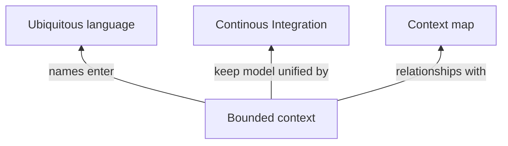
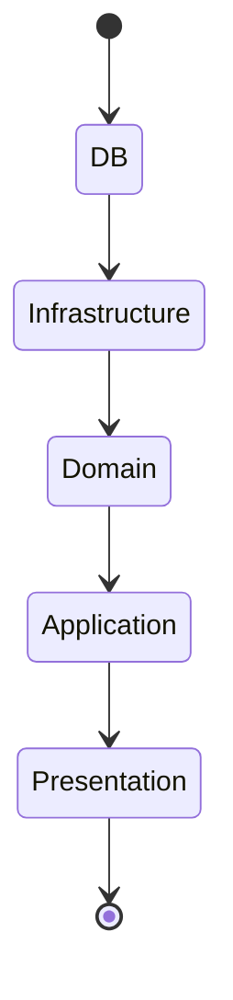
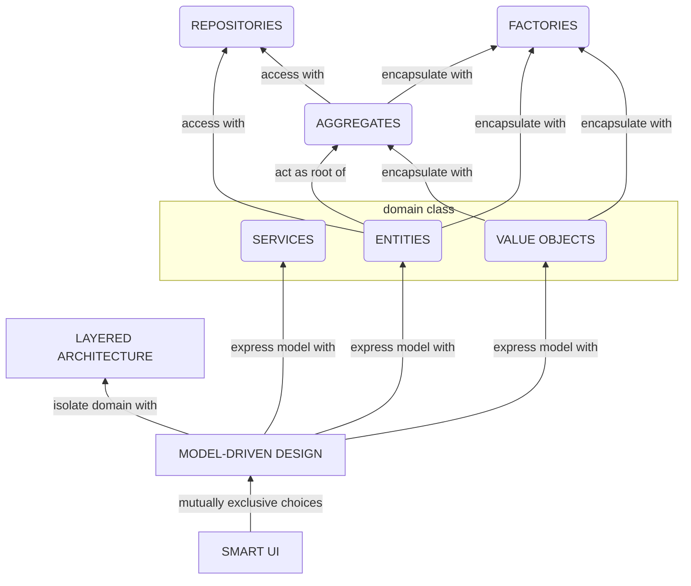

<article>

# Architecture d'entreprise

ArchiMate est un langage de modélisation ouvert d'architecture d'entreprise qui permet la description, l'analyse et la visualisation.

ArchiMate est une norme technique de l'`Open Group` et est aligné avec `TOGAF`.

ArchiMate se distingue des autres langages tels que le langage UML et la Business process model and notation (BPMN).

ArchiMate est bien adapté à l'architecture d'entreprise, UML fournit les détails nécessaires à l'architecture de solution, BPMN est le langage pour la modélisation détaillée des processus métiers.

ArchiMate et les outils (`Archi`, `Modelio`, ...) qui l'utilisent permettent de créer un `référentiel d'architecture d'entreprise`. C'est un atout fondamental de l'entreprise qui a besoin d'outils de gestion de haut niveau. Après plusieurs cycles d'architecture d'entreprise, ce référentiel contient des connaissances clés sur:

- l'organisation de l'entreprise
- l'architecture métier
- l'architecture informatique

Le même référentiel est utilisé pour les modèles (ArchiMate, UML, BPMN, …) et les éléments de Vision (Exigences, Objectifs, …) pour `réunir la vision, les objectifs et les exigences`.

## Domain-Driver Design (DDD)

### Introduction

Le Domain-Driven Design (DDD) est une approche de conception de logiciels qui se concentre sur la modélisation d'un domaine métier et sur la communication entre les parties prenantes techniques et non techniques d'un projet de développement logiciel.

### Concepts

#### Ubiquitous Language

#### Bounded context

##### Diagramme

Un bounded context est un contexte délimité. Il s’agit d’un ensemble de concepts qui ont un sens dans un domaine métier donné.

Un bounded context n’est pas un module. Un contexte délimité fournit le cadre logique au sein duquel le module évolue. Les modules sont utilisés pour organiser les éléments d’un modèle, donc le contexte délimité inclue / englobe le module.

L’aspect négatif découle du fait qu’avoir plusieurs modèles implique que les frontières doivent être définies ainsi que les relations entre les modèles. Ceci peut être difficile à gérer.

Il n’est pas suffisant d’avoir des modèles unifiés séparés. Ils doivent être intégrés, car la fonctionnalité de chaque modèle fait partie du système entier / dans son ensemble. A la fin, les bouts doivent être assemblés, et le système dans son ensemble doit fonctionner correctement.

##### Terminologie

###### Continuous integration

L’intégration continue est un process nécessaire dans le cadre d’un contexte délimité. Ce process d’intégration permet de s’assurer que l’ensemble des nouveaux éléments qui sont ajoutés correspondent de manière harmonieuse au reste du modèle, et sont correctement implémentés dans le code.

###### Context map

Il est conseillé d’utiliser le contexte sur la base de l’organisation de l’équipe. Les individus appartenant à la même équipe peuvent communiquer plus facilement, et peuvent faire un meilleur travail d’intégration et d’implémentation du modèle. Si chaque équipe travaille sur son propre modèle, il est préférable que tout le monde ait une idée de la vue d’ensemble / vision globale.

Un contexte map est un document qui esquisse les différents Bounded Context ainsi que les relations entre eux. Un Context map peut être un diagramme ou un document écrit. Le niveau de détail peut varier.

### Layers

#### Strategic design

#### Tactical design

##### Diagramme

##### Les termes

###### Les Entités

Les entités sont des catégories d’objet qui ont une identité qui au-delà des attributs qu’ils possèdent conservent une certaine continuité et une identité unique (i.e. une personne, un compte bancaire) pendant leur cycle de vie. Ceci peut se matérialiser au travers d’un identifiant unique, d’une clef primaire unique, etc.

Ces objets sont des objets fondamentaux du modèle et doivent être identifiés dès le début du processus de modélisation.

###### Value objects (objets-valeurs)

Un objet valeur, est une classe utilisée pour décrire certains aspects d’un domaine (métier), et qui ne possède pas une identité. Ici nous sommes intéressés par les attributs que possèdent l’objet et non pas son unicité. Ces objets-valeurs peuvent être créés et détruits lorsqu’ils ne sont plus référencés par un objet. Ces objets-valeurs doivent être immuables pendant leur durée de vie. Si l’on souhaite qu’ils aient une valeur différente, vaut mieux en créer un autre.

Etant donné que ce sont des objets sans identité et immuables, les objets-valeurs peuvent donc être partagés. Ceci permet de garantir l’intégrité de la donnée.

Les objets-valeurs sont utilisés pour contenir des attributs d’un objet métier.

###### Services

Lorsque nous définissons le _ubiquitous_ _language_, les concepts clefs du métier sont introduits dans le langage. Les noms du langage sont reproduits en objets, en classes. Les verbes du langage associés aux noms correspondants deviennent une partie du comportement de ces objets, des méthodes.

En revanche, il arrive parfois qu’il y ait des comportements actions, verbes du domaine métier qui ne peuvent être associés à un objet en particulier. Il peut s’agir d’un comportement partagé entre diverses classes mais qui ne peut être lié à aucune directement pour autant.

On peut déclarer un tel comportement comme un Service dont le seul rôle est de fournir une fonctionnalité au métier au service des entités et des objets-valeurs. Le Service encapsule un concept. Les Services agissent comme les Interfaces qui fournissent des opérations, on peut les utiliser dans la couche métier. Le Service est un point de connexion entre plusieurs objets.

###### Modules

Les Modules sont une méthode qui permet d’organiser des concepts et des tâches qui ont un lien les uns avec les autres de manière à réduire la complexité. Ceci est notamment important pour les applications larges et complexes, pour lesquels le modèle à tendance à grossir à un point où il devient difficile de l’appréhender comme un tout et de comprendre les relations et les interactions entre ses différents composants.

Cette gestion de la complexité consiste à définir plusieurs modules à un projet, les relations entre les modules, comprendre les interactions entre eux et ensuite seulement regarder les détails à l’intérieur d’un module.

Recourir aux modules permet de garantir aussi la qualité du code. Le code doit avoir un niveau élevé de cohésion et un faible niveau de couplage.

###### Agrégats / Factories / Repositories

Les objets du domaine traversent un certain nombre d’états pendant leur durée de vie. Ces objets sont créés, placés en mémoire, utilisés pendant les traitements, sauvegardés dans des endroits permanents et ensuite détruits.

Il existe trois patterns qui peuvent gérer cela.

**Les `agrégats` permettent de définir la propriété et les frontières des objets. Ils peuvent être composés d’une entité + value object.**

Un **agrégat DDD** est un regroupement d'objets de domaine qui peuvent être traités comme une seule unité. Un exemple peut être une commande et ses articles, qui sont des objets distincts, mais il est utile de traiter la commande (avec ses articles) comme un seul agrégat.

Un agrégat aura l'un de ses objets composants en tant que racine de l'agrégat. Toutes les références provenant de l'extérieur de l'agrégat devraient uniquement aller vers la racine de l'agrégat. Ainsi, la racine peut garantir l'intégrité de l'agrégat dans son ensemble.

Les agrégats sont l'élément de base pour le transfert de stockage de données - vous demandez de charger ou de sauvegarder des agrégats entiers. Les transactions ne doivent pas franchir les limites des agrégats.

Les agrégats DDD sont parfois confondus avec des classes de collection (listes, cartes, etc.). Les agrégats DDD sont des concepts de domaine (process metier de commande, visite en clinique, liste de lecture, etc.), tandis que les collections sont génériques. Un agrégat contiendra souvent plusieurs collections, ainsi que des champs simples.

Le terme "agrégat" est couramment utilisé et est utilisé dans divers contextes différents (par exemple, UML), auquel cas il ne fait pas référence au même concept qu'un agrégat DDD.

Les `factories` et `repositories` permettent de gérer la création et le stockage des objets.

**La `Factory` crée des objets.**

Les **factories** sont utilisées pour créer des objets complexes qui nécessitent plusieurs étapes de construction ou des objets qui nécessitent des informations supplémentaires telles que des paramètres de configuration.

**Le `Repository` reconstruit des objets existants.**

Les **repositories** sont utilisés pour charger et stocker des agrégats. Les repositories sont généralement utilisés pour encapsuler l'accès aux bases de données, mais peuvent également être utilisés pour encapsuler l'accès à d'autres systèmes de stockage tels que les systèmes de fichiers ou les services Web.

## Sources

- <https://lesdieuxducode.com/blog/2019/7/introduction-au-domain-driven-design>
- <https://martinfowler.com/bliki/DDD_Aggregate.html>
- Domain-Driven Design: Tackling Complexity in the Heart of Software, Eric Evans, Addison-Wesley Professional, 2003

</article>
