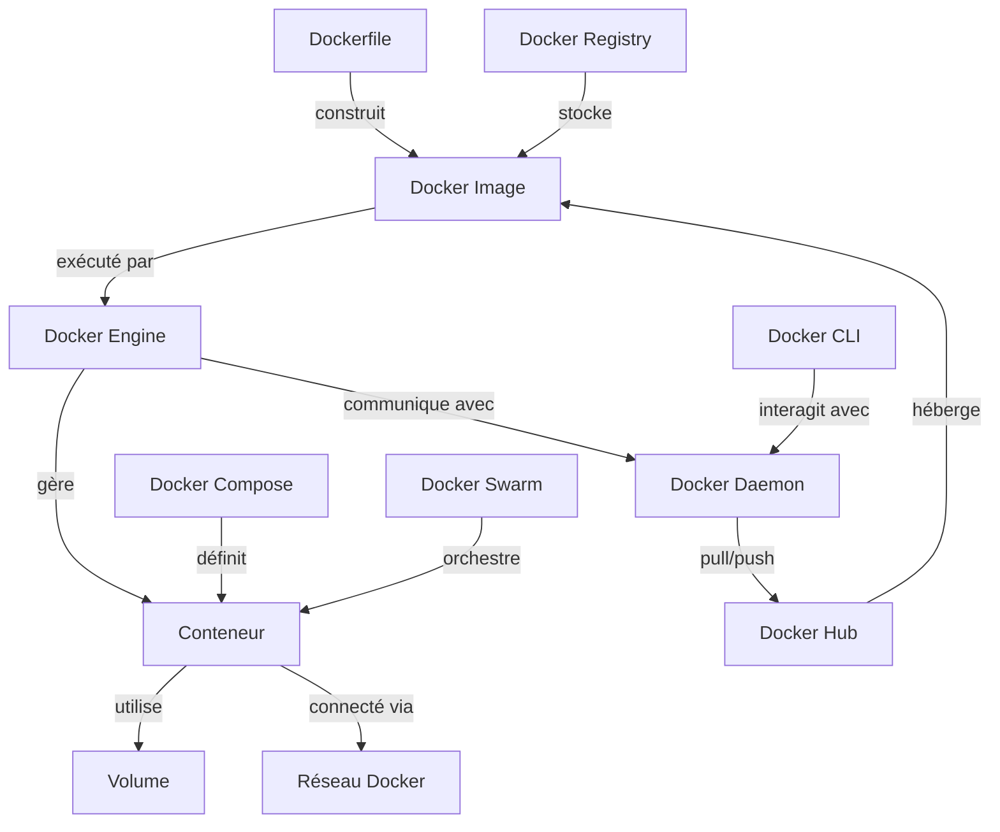
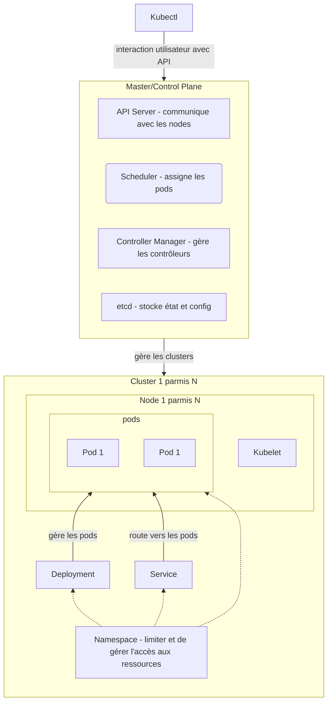

<article>

- [Définition Conteneur / Conteinerisation](#définition-conteneur--conteinerisation)
- [Docker](#docker)
- [Kubernetes](#kubernetes)
  - [Qu'est-ce que Kubernetes ?](#quest-ce-que-kubernetes-)
  - [Termes clés et concepts](#termes-clés-et-concepts)
  - [Diagramme de composants Kubernetes](#diagramme-de-composants-kubernetes)

## Définition Conteneur / Conteinerisation

Un `conteneur (container en anglais)` est utilisé pour bénéficier d'un espace d'exécution dédié à une application logicielle. Il peut se présenter sous la forme d'un type de données abstrait, d'une structure d'informations ou encore d'une classe.

L'usage d'un conteneur permet de tester des applications en développement avec les mêmes contraintes que sur l'environnement de production (`réplicabilité`), sur de multiples supports avec le même rendu (`portabilité`). L'intérêt est de disposer d'un environnement isolé pour réaliser tous les contrôles nécessaires avant le déploiement. Il est donc plus facile de distinguer les dysfonctionnements, les failles de sécurité et d'éventuels problèmes de stabilité.

`A l'inverse d'une machine virtuelle (ou VM)` qui dispose de son propre système d'exploitation, le conteneur utilise l'OS de l'ordinateur où il est installé. Bien que ce dernier aspect soit pratique, `la puissance sollicitée est inférieure`, en particulier sur les ressources de la mémoire.

Parmi les outils de gestion de conteneurs les plus réputés, on peut citer `Docker`. Disponible en open source, `Kubernetes` permet de déployer et de réaliser des opérations de maintenance dans des environnements conteneurisés (Docker ou autre) parfaitement sécurisés.

Des architecture et solutions complètes utilisant la conteneurisation permettent d'obtenir l'`agilité`, la `sécurité` et la `mise à l'échelle` de ses services

---

## Docker

Docker, un outil populaire pour la création, le déploiement et la gestion de conteneurs, utilise un ensemble spécifique de termes et de concepts clés. Voici une liste du vocabulaire essentiel associé à Docker

- **Conteneur** : Une instance légère, portable et exécutable qui contient tout ce dont une application a besoin pour s'exécuter, y compris le code, les bibliothèques, les variables d'environnement, et les fichiers de configuration.

- **Image Docker** : Un modèle immuable utilisé pour créer des conteneurs. Il contient l'application et toutes ses dépendances.

- **Dockerfile** : Un script contenant des instructions pour construire une image Docker.

- **Docker Hub** : Un registre public pour trouver, partager et gérer des images Docker.

- **Docker Compose** : Un outil pour définir et exécuter des applications multi-conteneurs avec Docker, en utilisant un fichier YAML pour configurer les services de l'application.

- **Volume** : Un système de stockage persistant utilisé par Docker pour conserver les données générées par et utilisées par les conteneurs Docker.

- **Docker Engine** : Le cœur de Docker, il s'agit d'un service client-serveur qui construit et exécute des conteneurs en utilisant la technologie des conteneurs Linux.

- **Docker Swarm** : Un outil de gestion de cluster pour Docker qui permet de transformer un ensemble de machines Docker en un seul hôte virtuel Docker.

- **Réseau Docker** : La couche de réseau intégrée à Docker qui permet aux conteneurs de communiquer entre eux et avec l'extérieur.

- **Docker Daemon** : Le service en arrière-plan qui gère la création, l'exécution et la distribution des conteneurs Docker.

- **Docker Registry** : Un service de stockage et de distribution d'images Docker. Docker Hub et d'autres solutions tierces offrent des registres Docker.

- **Docker CLI** : L'interface en ligne de commande pour interagir avec Docker.

---

## Kubernetes

### Qu'est-ce que Kubernetes ?

Kubernetes est utilisé pour déployer et effectuer des opérations de maintenance dans des environnements conteneurisés, tels que Docker, de manière sécurisée.

Kubernetes est un système open-source puissant et flexible pour la gestion de conteneurs, conçu pour automatiser le déploiement, la mise à l'échelle et l'opération des applications conteneurisées. Voici une explication plus détaillée :

1. **Gestion de conteneurs** : Kubernetes permet de gérer des conteneurs, qui sont des unités légères et portables pour les applications. Les conteneurs sont souvent utilisés pour empaqueter les composants d'une application et leurs dépendances.

2. **Orchestration** : Kubernetes sert d'orchestrateur de conteneurs, ce qui signifie qu'il automatise de nombreuses tâches nécessaires pour gérer des applications à grande échelle, telles que le déploiement, les mises à jour, la mise à l'échelle et la disponibilité.

3. **Abstraction et automatisation** : Il abstrait la couche d'infrastructure (comme les serveurs physiques ou virtuels) et permet aux développeurs de déployer leurs applications sans se soucier des détails de l'infrastructure sous-jacente. Kubernetes automatise le placement et la gestion des conteneurs dans le cluster.

4. **Scalabilité et disponibilité** : Kubernetes facilite la mise à l'échelle des applications en fonction de la demande et assure leur disponibilité en répliquant les conteneurs et en équilibrant la charge entre eux.

5. **Ecosystème et communauté** : En tant que projet de la Cloud Native Computing Foundation (CNCF), Kubernetes bénéficie d'un large écosystème et d'une communauté active, contribuant à une variété d'outils et de plugins pour étendre ses fonctionnalités.

6. **Multi-cloud et portabilité** : Kubernetes est conçu pour fonctionner dans différents environnements, y compris sur site, dans le cloud public (comme AWS, Google Cloud, Azure) et dans des configurations hybrides, offrant une grande portabilité et flexibilité.

### Termes clés et concepts

Pour enrichir votre compréhension de Kubernetes, voici quelques termes clés et concepts associés :

1. **Pods** : L'unité de base de Kubernetes, représentant un ensemble de conteneurs en cours d'exécution sur votre cluster.
2. **Cluster** : Un ensemble de machines, appelées nœuds, qui exécutent des conteneurs gérés par Kubernetes.
3. **Kubelet** : Un agent exécuté sur chaque nœud du cluster, s'assurant que les conteneurs sont en cours d'exécution dans un Pod.
4. **Kubectl** : L'outil en ligne de commande pour interagir avec le cluster Kubernetes.
5. **Deployment** : Une spécification pour déployer des applications (conteneurs) sur le cluster.
6. **Service** : Une abstraction qui définit un ensemble logique de Pods et une politique permettant d'y accéder.
7. **Namespace** : Permet de diviser les ressources du cluster entre plusieurs utilisateurs.
8. **Master / Control Plane** : Le processus principal qui gère le cluster Kubernetes.
9. **API Server (kube-apiserver)** : C'est le point d'entrée de l'API Kubernetes. Il traite toutes les requêtes REST et met à jour l'état du cluster dans etcd.
10. **Scheduler (kube-scheduler)** : Il assigne les Pods nouvellement créés aux nœuds, en tenant compte des contraintes de ressources, de la qualité de service, des affinités et anti-affinités, etc.
11. **Controller Manager (kube-controller-manager)** : Ce composant exécute les processus de contrôle en arrière-plan. Il inclut le Node Controller, le Replication Controller, les Endpoints Controller, et d'autres.
12. **etcd** : Un magasin de données clé-valeur qui sert de base de données de sauvegarde pour l'ensemble du cluster. Il stocke la configuration et l'état du cluster.

### Diagramme de composants Kubernetes

</article>
